# Lecture 13 Graded Homework

### Task 1: Kubernetes Volumes and Persistent Storage

- **Short Description:** Learned and tested different Kubernetes storage options including `emptyDir`, `hostPath`, PersistentVolume, PersistentVolumeClaim, StorageClass and Dynamic Provisioning.

- **Commands to Run:**

```bash
# emptyDir
kubectl apply -f 01-volumes/emptydir-pod.yaml
kubectl get pods
kubectl exec emptydir-demo -- sh -c 'echo "Hello Kubernetes" > /data/message.txt'
kubectl exec emptydir-demo -- cat /data/message.txt

kubectl delete pod emptydir-demo
kubectl apply -f 01-volumes/emptydir-pod.yaml
kubectl exec emptydir-demo -- cat /data/message.txt
```

```bash
# hostPath
kubectl apply -f 01-volumes/hostpath-pod.yaml
kubectl get pods
kubectl describe pod hostpath-demo
```

```bash
# PersistentVolume and PersistentVolumeClaim
kubectl apply -f 02-persistent-storage/pv.yaml
kubectl apply -f 02-persistent-storage/pvc.yaml

kubectl get pv
kubectl get pvc

kubectl apply -f 02-persistent-storage/pod.yaml
kubectl get pods
```

```bash
# StorageClass
kubectl get storageclass
```

- **What I Learned:**
    - `emptyDir` provides temporary storage and its data is deleted when the Pod is deleted.
    - `hostPath` mounts a directory from the Kubernetes node inside the Pod.
    - A PersistentVolume provides storage to the cluster.
    - A PersistentVolumeClaim is a request made by a Pod for persistent storage.
    - A StorageClass defines how storage should be created.
    - Dynamic provisioning automatically creates storage when a PVC requests it.

- **Screenshots:**
    > 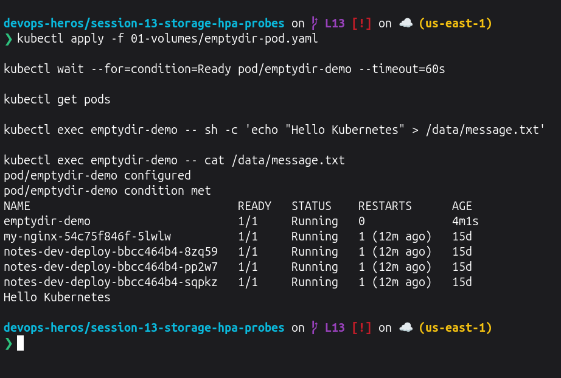
    > 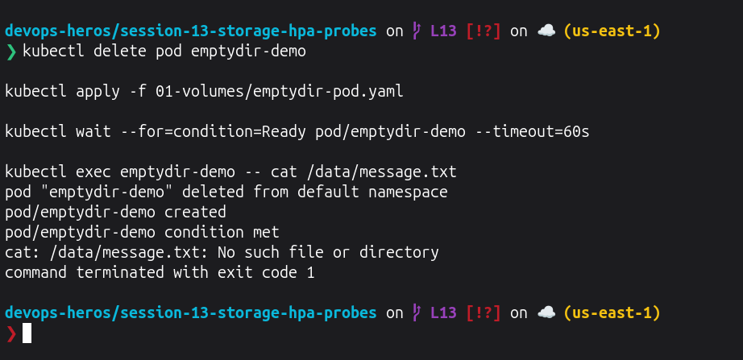
    > 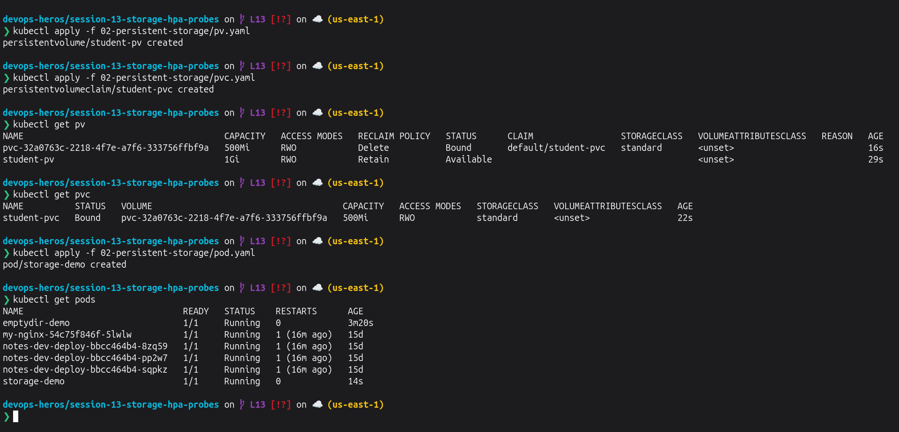  
    > 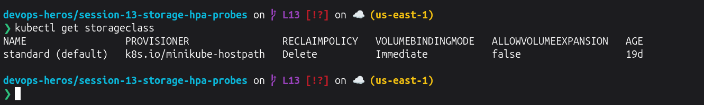

---

### Task 2: Horizontal Pod Autoscaler (HPA)

- **Short Description:** Deployed an application with HPA and generated load to observe CPU utilization and automatic Pod scaling.

- **Commands to Run:**

```bash
minikube addons enable metrics-server

kubectl apply -f 04-hpa/deployment.yaml
kubectl apply -f 04-hpa/service.yaml
kubectl apply -f 04-hpa/hpa.yaml

kubectl get pods
kubectl get hpa
kubectl top pods
```

```bash
kubectl run load-generator \
  --image=busybox:1.36 \
  --restart=Never \
  -- /bin/sh -c \
  "while true; do wget -q -O- http://hpa-demo-service; done"
```

```bash
kubectl get hpa
kubectl get pods
kubectl top pods
kubectl describe hpa hpa-demo
```

```bash
kubectl delete pod load-generator
```

- **Screenshots:**
    > 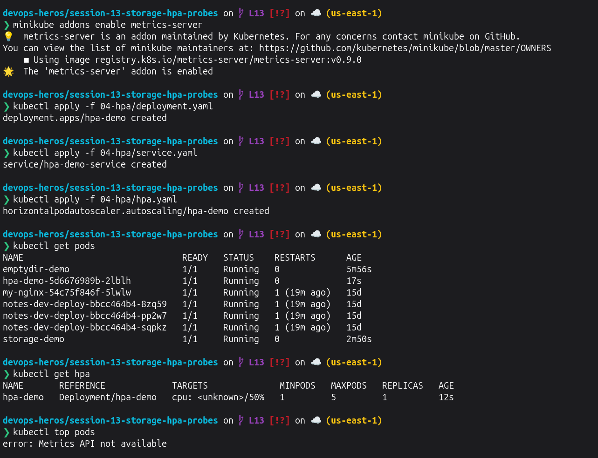 
    > 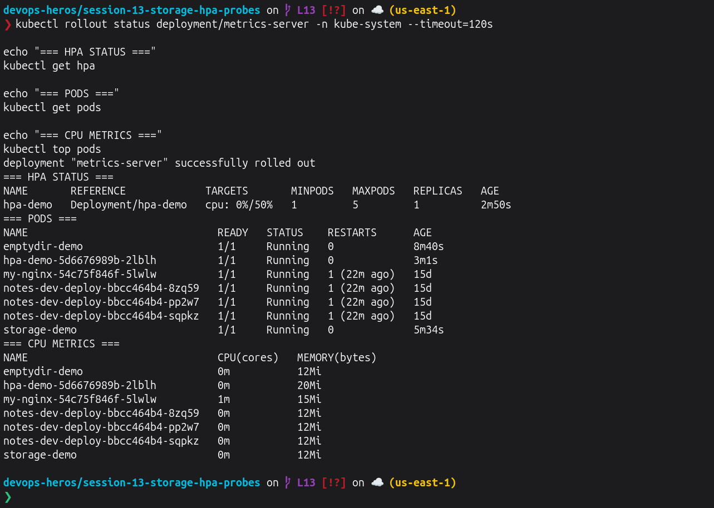
    > 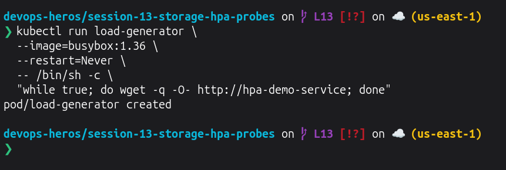 
    > 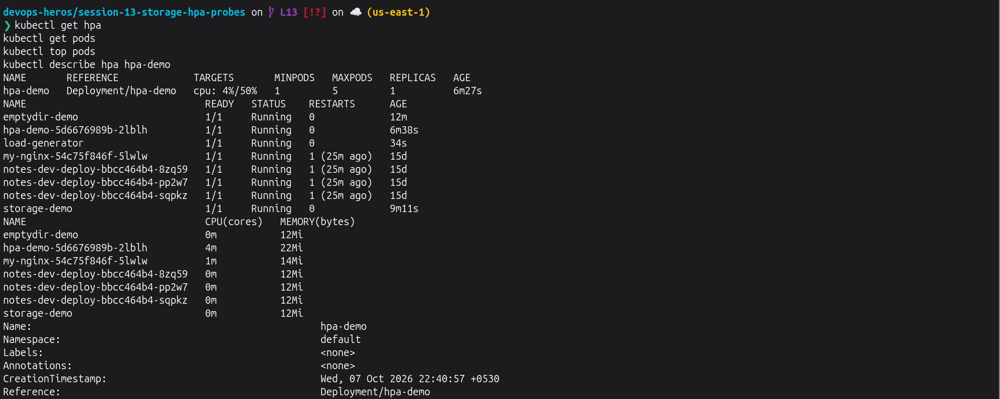
    > 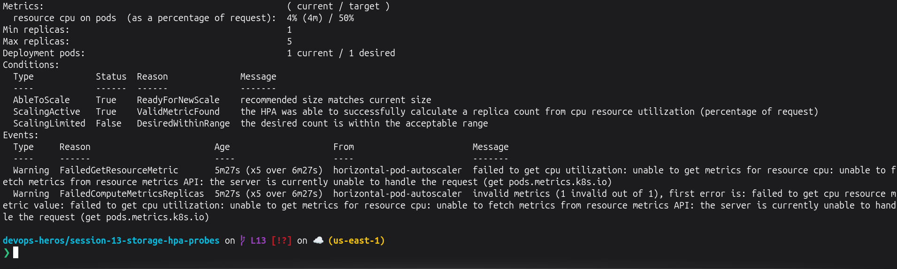

---

### Task 3: Mini Project - Production Ready Kubernetes Web App

- **Short Description:** Deployed the Session 13 mini project containing persistent storage, HPA and Kubernetes health probes.

- **Commands to Run:**

```bash
kubectl apply -f mini-project/namespace.yaml
kubectl apply -f mini-project/pvc.yaml
kubectl apply -f mini-project/deployment.yaml
kubectl apply -f mini-project/service.yaml
kubectl apply -f mini-project/hpa.yaml
```

```bash
kubectl get pods -n production-webapp
kubectl get pvc -n production-webapp
kubectl get svc -n production-webapp
kubectl get hpa -n production-webapp
```

#### Storage Persistence Test

```bash
POD_NAME=$(kubectl get pods -n production-webapp -l app=web-app -o jsonpath='{.items[0].metadata.name}')

kubectl exec -n production-webapp "$POD_NAME" -- sh -c 'echo "Student: Lavanya Soni" > /data/student.txt'

kubectl exec -n production-webapp "$POD_NAME" -- cat /data/student.txt

kubectl delete pod -n production-webapp "$POD_NAME"
```

```bash
kubectl get pods -n production-webapp

NEW_POD=$(kubectl get pods -n production-webapp -l app=web-app -o jsonpath='{.items[0].metadata.name}')

kubectl exec -n production-webapp "$NEW_POD" -- cat /data/student.txt
```

#### HPA Scaling Test

```bash
kubectl run load-generator -n production-webapp \
  --image=busybox:1.36 \
  --restart=Never \
  -- /bin/sh -c "while true; do wget -q -O- http://web-service; done"
```

```bash
kubectl get hpa -n production-webapp
kubectl get pods -n production-webapp
kubectl top pods -n production-webapp
```

```bash
kubectl delete pod load-generator -n production-webapp
```

#### Probe Verification

```bash
kubectl describe deployment web-app -n production-webapp
kubectl describe pod -n production-webapp -l app=web-app
```

- **Screenshots:**
    > 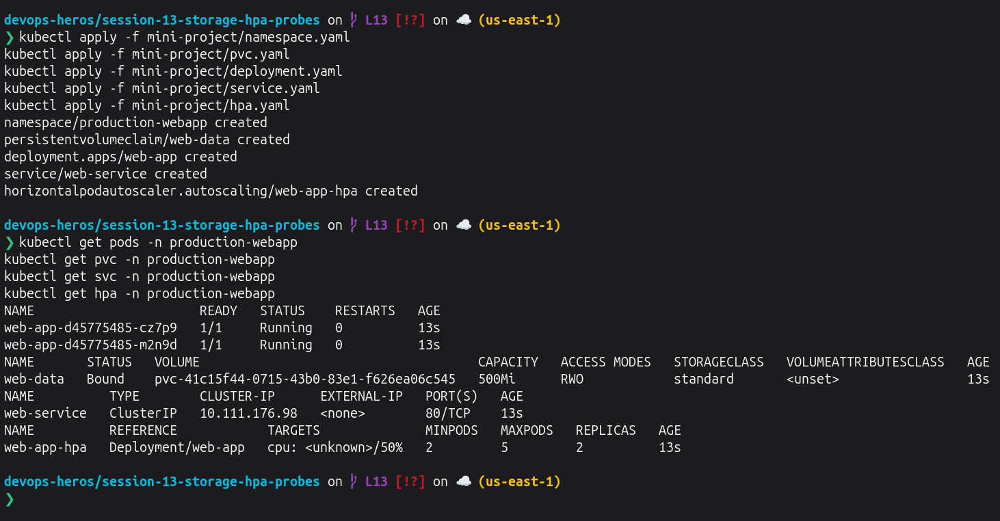
    > 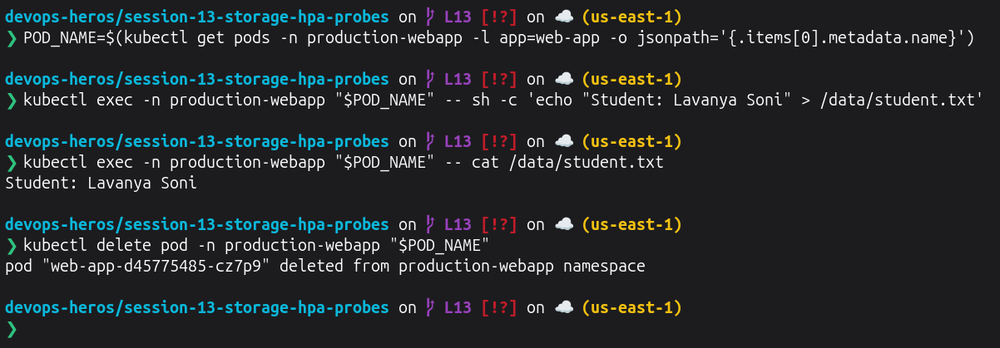
    > 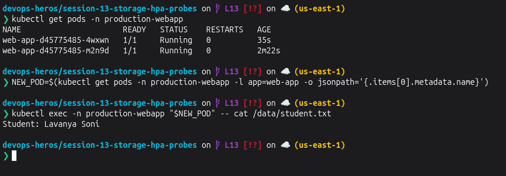
    > 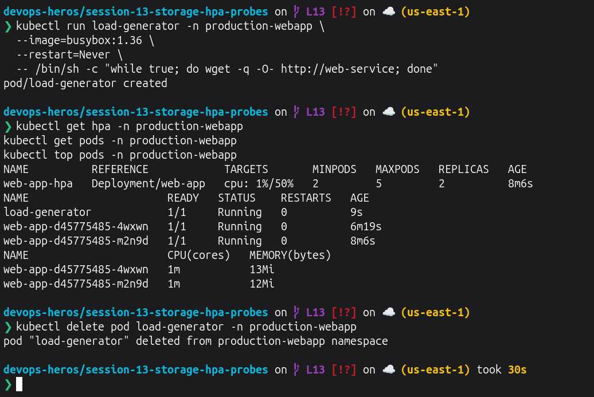 
    > 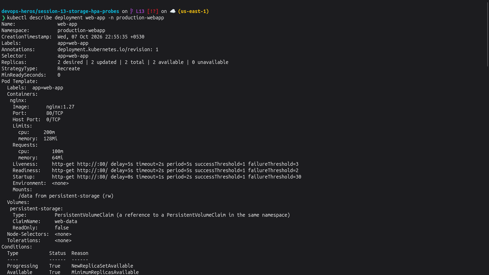
    > 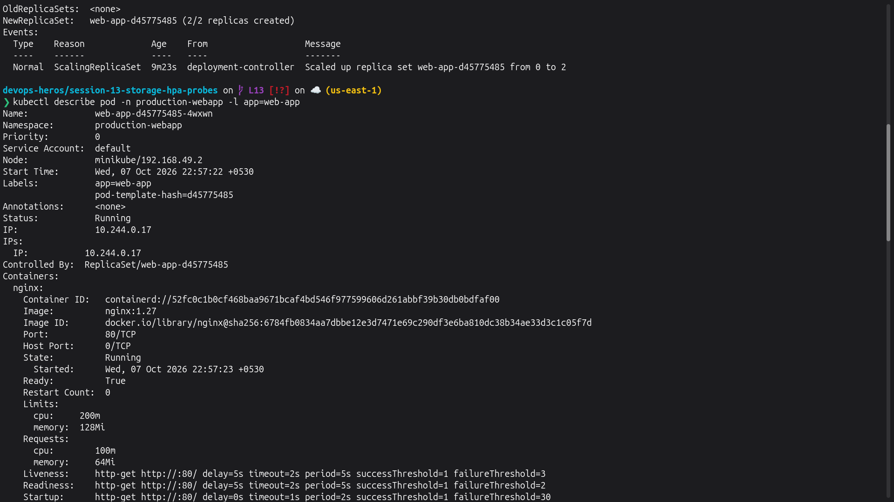
    > 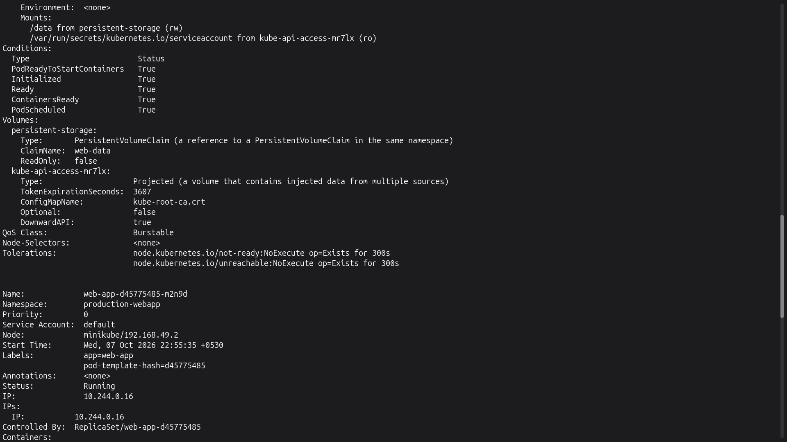
    > 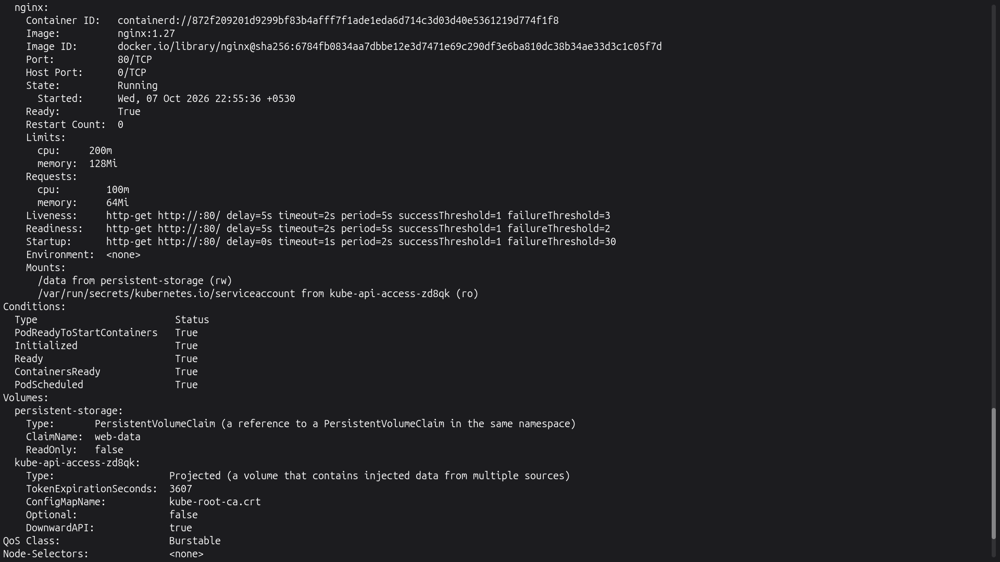