# Lecture 14 Graded Homework

### Task 1: Kubernetes Troubleshooting Commands

- **Short Description:** Practiced the main Kubernetes troubleshooting commands used to inspect Pods, check logs, enter containers, view events, inspect resource documentation and monitor resource usage. L14-Instructions

- **Commands to Run:**

```bash
kubectl apply -f 01-kubectl-get/sample-workload.yaml

kubectl wait --for=condition=Ready pod/get-demo --timeout=120s

echo "=== WAITING FOR POD METRICS ==="

for i in {1..12}; do
  if kubectl top pod get-demo >/tmp/get-demo-metrics.txt 2>/dev/null; then
    break
  fi
  sleep 5
done

echo "=== KUBECTL GET ==="
kubectl get pod get-demo

echo "=== KUBECTL GET -O WIDE ==="
kubectl get pod get-demo -o wide

echo "=== KUBECTL EXEC ==="
kubectl exec get-demo -- sh -c 'echo "Exec successful"; hostname'

echo "=== KUBERNETES EVENTS ==="
kubectl get events --field-selector involvedObject.name=get-demo --sort-by=.lastTimestamp | tail -n 8

echo "=== KUBECTL EXPLAIN ==="
kubectl explain pod.spec.containers | head -n 12

echo "=== KUBECTL TOP ==="
cat /tmp/get-demo-metrics.txt
```

**Screenshot:**
> 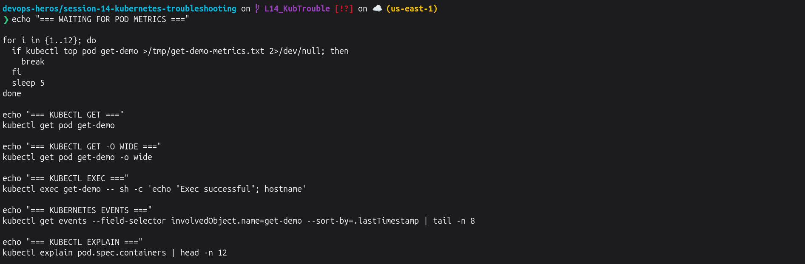 
> 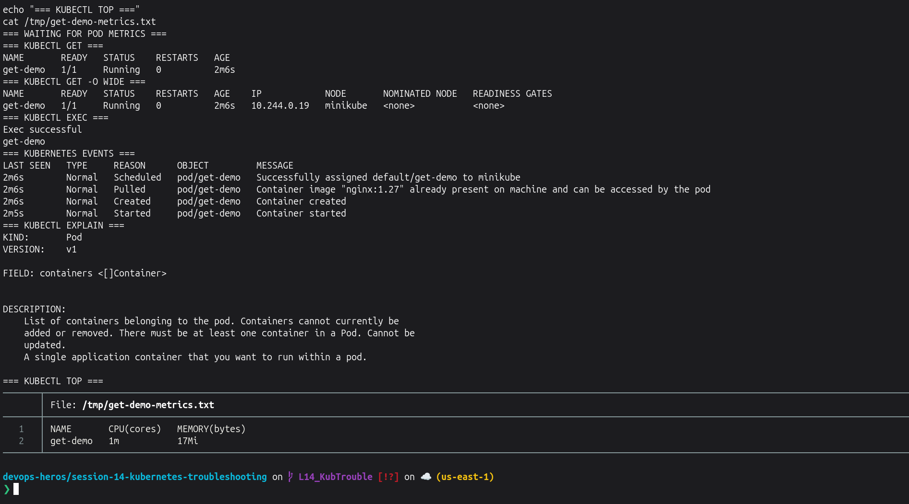

---

### Task 2.1: Troubleshooting CrashLoopBackOff

- **Problem:** The Pod repeatedly starts and crashes.
- **Root Cause:** The container command exits with exit code `1`.
- **Solution:** Replace the broken Pod with the provided fixed Pod. 

- **Commands to Run:**

```bash
kubectl delete pod crash-demo --ignore-not-found

kubectl apply -f 06-crashloopbackoff/broken-pod.yaml

echo "=== WAITING FOR CRASH STATE ==="
for i in {1..12}; do
  STATUS=$(kubectl get pod crash-demo -o jsonpath='{.status.containerStatuses[0].state.waiting.reason}' 2>/dev/null || true)
  if [ "$STATUS" = "CrashLoopBackOff" ]; then
    break
  fi
  sleep 5
done

echo "=== BEFORE FIX ==="
kubectl get pod crash-demo

echo "=== APPLICATION LOGS ==="
kubectl logs crash-demo --previous 2>/dev/null || kubectl logs crash-demo 2>/dev/null || true

echo "=== EVENTS ==="
kubectl get events --field-selector involvedObject.name=crash-demo --sort-by=.lastTimestamp | tail -n 8

echo "=== APPLYING FIX ==="
kubectl delete pod crash-demo --wait=true
kubectl apply -f 06-crashloopbackoff/fixed-pod.yaml

kubectl wait --for=condition=Ready pod/crash-demo --timeout=120s

echo "=== AFTER FIX ==="
kubectl get pod crash-demo

echo "=== FIXED POD LOGS ==="
kubectl logs crash-demo
```

**Screenshot:** 
> 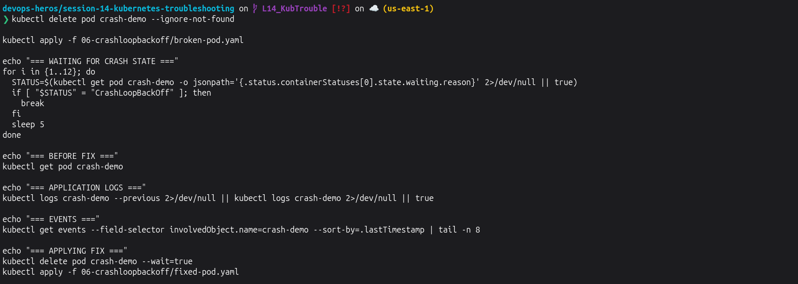
> 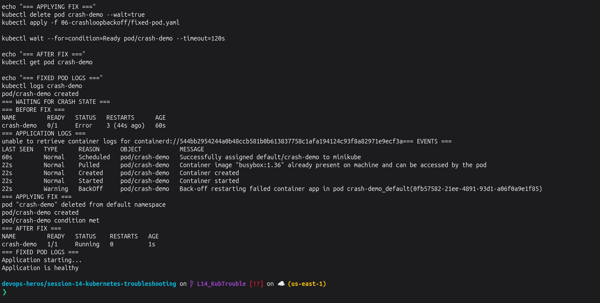

---

### Task 2.2: Troubleshooting ErrImagePull / ImagePullBackOff

- **Problem:** Kubernetes cannot download the container image.
- **Root Cause:** The image uses a tag that does not exist.
- **Solution:** Replace it with the fixed Pod using a valid Nginx image. 

- **Commands to Run:**

```bash
kubectl delete pod image-demo --ignore-not-found

kubectl apply -f 07-imagepullbackoff/broken-pod.yaml

echo "=== WAITING FOR IMAGE PULL FAILURE ==="
for i in {1..12}; do
  STATUS=$(kubectl get pod image-demo -o jsonpath='{.status.containerStatuses[0].state.waiting.reason}' 2>/dev/null || true)
  if [ "$STATUS" = "ImagePullBackOff" ] || [ "$STATUS" = "ErrImagePull" ]; then
    break
  fi
  sleep 5
done

echo "=== BEFORE FIX ==="
kubectl get pod image-demo

echo "=== IMAGE PULL EVENTS ==="
kubectl get events --field-selector involvedObject.name=image-demo --sort-by=.lastTimestamp | tail -n 8

echo "=== APPLYING FIX ==="
kubectl delete pod image-demo --wait=true
kubectl apply -f 07-imagepullbackoff/fixed-pod.yaml

kubectl wait --for=condition=Ready pod/image-demo --timeout=120s

echo "=== AFTER FIX ==="
kubectl get pod image-demo
```

**Screenshot:**
> 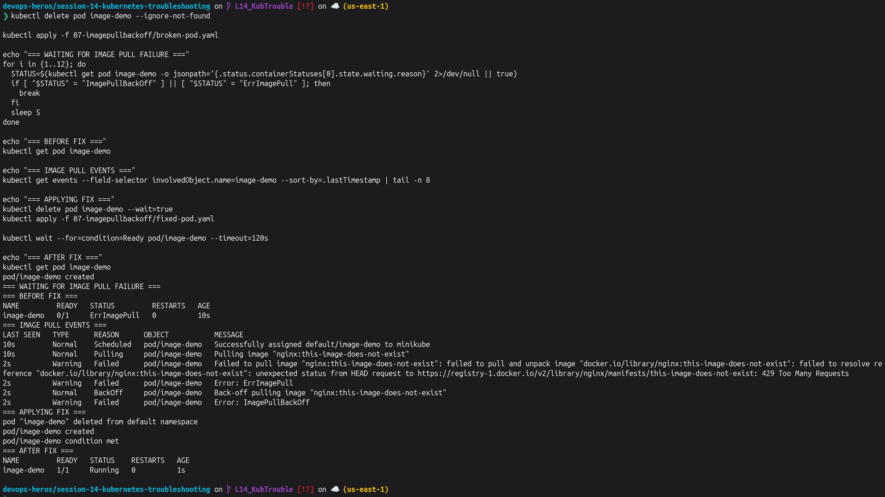

---

### Task 2.3: Troubleshooting Pending Pod

- **Problem:** The Pod remains in `Pending`.
- **Root Cause:** Its `nodeSelector` asks for a node called `node-that-does-not-exist`.
- **Solution:** Replace the Pod with the provided fixed configuration. 

- **Commands to Run:**

```bash
kubectl delete pod pending-demo --ignore-not-found

kubectl apply -f 08-pending-pods/broken-pod.yaml

echo "=== WAITING FOR PENDING STATE ==="
for i in {1..10}; do
  STATUS=$(kubectl get pod pending-demo -o jsonpath='{.status.phase}' 2>/dev/null || true)
  if [ "$STATUS" = "Pending" ]; then
    break
  fi
  sleep 3
done

echo "=== BEFORE FIX ==="
kubectl get pod pending-demo

echo "=== AVAILABLE NODES ==="
kubectl get nodes

echo "=== SCHEDULING EVENTS ==="
kubectl get events --field-selector involvedObject.name=pending-demo --sort-by=.lastTimestamp | tail -n 8

echo "=== APPLYING FIX ==="
kubectl delete pod pending-demo --wait=true
kubectl apply -f 08-pending-pods/fixed-pod.yaml

kubectl wait --for=condition=Ready pod/pending-demo --timeout=120s

echo "=== AFTER FIX ==="
kubectl get pod pending-demo
```

**Screenshot:**
> 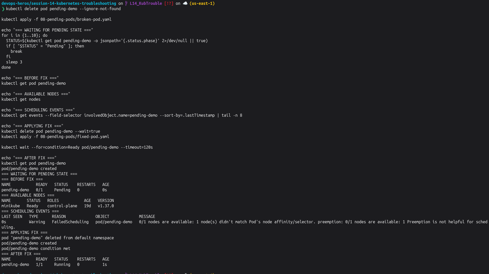

---

### Task 2.4: Service Connectivity, DNS and Pod Networking

- **Problem:** Service communication can fail when its selector does not match any Pod.
- **Root Cause:** The broken Service looks for a Pod label that does not exist.
- **Solution:** Use the correct Service whose selector matches the application Pods. 

- **Commands to Run:**

```bash
kubectl delete pod dns-test --ignore-not-found

kubectl run dns-test \
  --image=busybox:1.36 \
  --restart=Never \
  --command -- sleep 3600

kubectl wait --for=condition=Ready pod/dns-test --timeout=120s

echo "=== HEALTHY PODS AND LABELS ==="
kubectl get pods -l app=web --show-labels

echo "=== HEALTHY SERVICE ENDPOINTS ==="
kubectl get endpoints web-service

echo "=== SERVICE DNS TEST ==="
kubectl exec dns-test -- nslookup web-service

echo "=== SERVICE CONNECTIVITY TEST ==="
kubectl exec dns-test -- wget -qO- http://web-service | head -n 5

echo "=== BROKEN SERVICE ==="
kubectl apply -f 09-service-dns-troubleshooting/broken-service.yaml
sleep 3
kubectl get endpoints broken-service

echo "=== CORRECT SERVICE ==="
kubectl get endpoints web-service
```

**Screenshot:** 
> 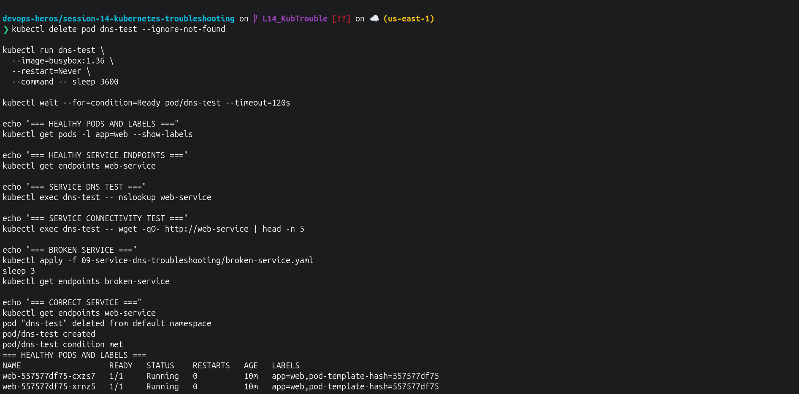
> 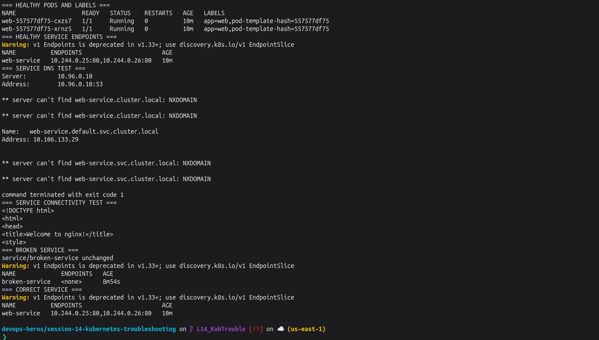

---

### Task 2.5: Configuration and Cluster Troubleshooting Checks

- **Commands to Run:**

```bash
echo "=== VERIFY DNS TEST POD ==="
kubectl get pod dns-test -o wide

echo "=== POD STATUS ==="
kubectl get pods -o wide

echo "=== RECENT EVENTS ==="
kubectl get events --sort-by=.lastTimestamp | tail -n 15

echo "=== COREDNS STATUS ==="
kubectl get pods -n kube-system -l k8s-app=kube-dns

echo "=== DNS LOOKUP FROM POD ==="
kubectl exec dns-test -- nslookup web-service

echo "=== DNS CONFIGURATION INSIDE POD ==="
kubectl exec dns-test -- cat /etc/resolv.conf

echo "=== COREDNS LOGS ==="
kubectl logs -n kube-system -l k8s-app=kube-dns --tail=10
```

**Screenshot:**
> 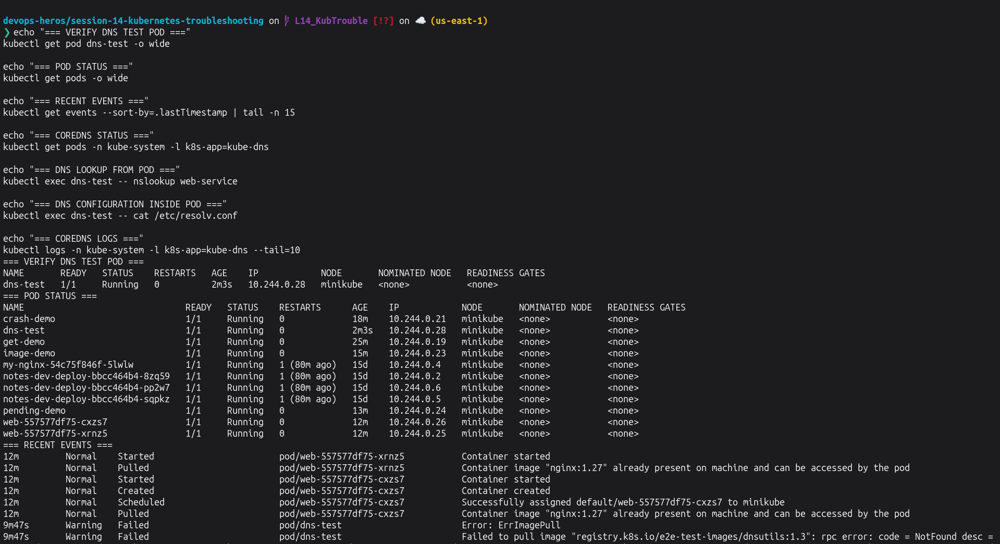
> 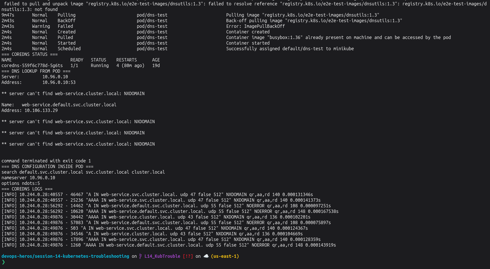

---

### Task 3: Kubernetes Troubleshooting Mini Project

The mini project requires checking a working Nginx Deployment and Service, troubleshooting a broken image, intentionally creating a Service selector problem, fixing it, and verifying the final application. 

#### 3.1 Deploy and Verify the Application

```bash
kubectl apply -f mini-project/deployment.yaml
kubectl apply -f mini-project/service.yaml

kubectl rollout status deployment/troubleshooting-app --timeout=120s

echo "=== WAITING FOR SERVICE ENDPOINTS ==="
for i in {1..12}; do
  ENDPOINTS=$(kubectl get endpoints troubleshooting-service -o jsonpath='{.subsets[*].addresses[*].ip}' 2>/dev/null || true)
  if [ -n "$ENDPOINTS" ]; then
    break
  fi
  sleep 3
done

echo "=== PODS ==="
kubectl get pods -l app=troubleshooting-app -o wide

echo "=== SERVICE ==="
kubectl get service troubleshooting-service

echo "=== ENDPOINTS ==="
kubectl get endpoints troubleshooting-service

echo "=== POD LABELS ==="
kubectl get pods -l app=troubleshooting-app --show-labels
```

**Screenshot:**
> 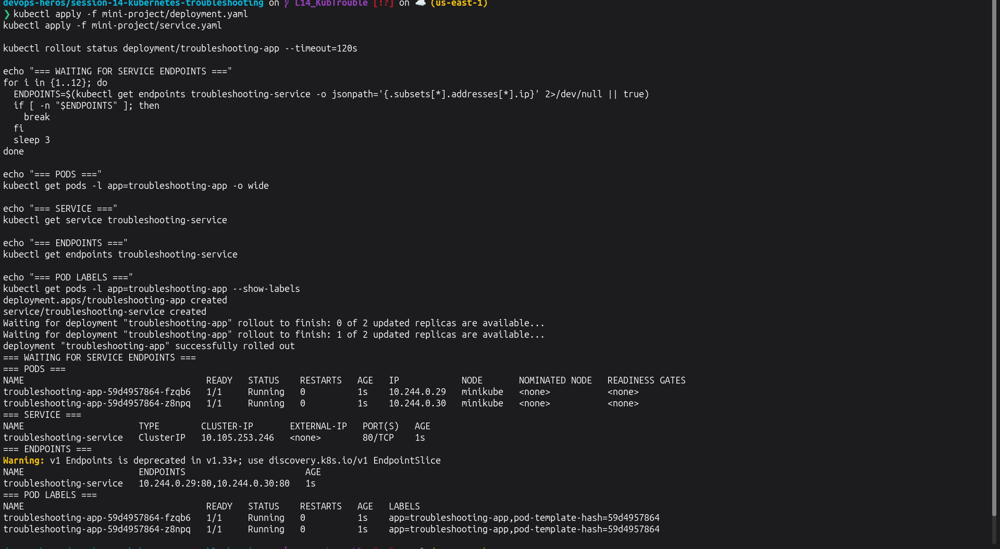

---

#### 3.2 Broken Pod Investigation and Fix

The provided broken Pod uses the invalid image `nginx:this-tag-does-not-exist`. 

```bash
kubectl delete pod project-broken-pod --ignore-not-found

kubectl apply -f mini-project/broken-pod.yaml

echo "=== WAITING FOR IMAGE FAILURE ==="
for i in {1..12}; do
  STATUS=$(kubectl get pod project-broken-pod -o jsonpath='{.status.containerStatuses[0].state.waiting.reason}' 2>/dev/null || true)
  if [ "$STATUS" = "ImagePullBackOff" ] || [ "$STATUS" = "ErrImagePull" ]; then
    break
  fi
  sleep 5
done

echo "=== BEFORE FIX ==="
kubectl get pod project-broken-pod

echo "=== ROOT CAUSE FROM EVENTS ==="
kubectl get events --field-selector involvedObject.name=project-broken-pod --sort-by=.lastTimestamp | tail -n 8

echo "=== FIXING IMAGE ==="
kubectl delete pod project-broken-pod --wait=true
kubectl run project-broken-pod --image=nginx:1.27

kubectl wait --for=condition=Ready pod/project-broken-pod --timeout=120s

echo "=== AFTER FIX ==="
kubectl get pod project-broken-pod
```

**Screenshot:**
> 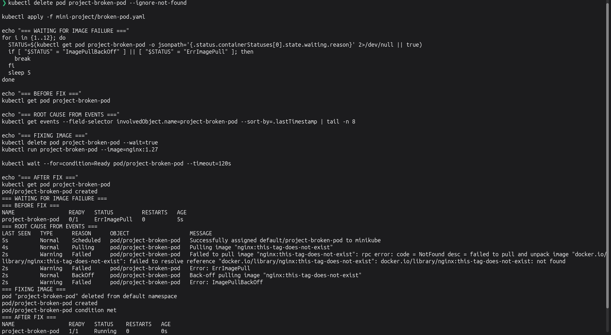

**Answers:**

1. **Pod Status:** `ErrImagePull` or `ImagePullBackOff`.
2. **Actual Error:** Kubernetes cannot pull the requested container image.
3. **Command that helped find the reason:** `kubectl describe pod project-broken-pod` / Pod Events.
4. **What is wrong with the image:** The tag `this-tag-does-not-exist` is invalid.
5. **Fix:** Use a valid image such as `nginx:1.27`.

---

#### 3.3 Service Selector Troubleshooting

The correct Service selector is `app: troubleshooting-app`, matching the Deployment Pods.  

```bash
echo "=== BEFORE BREAKING SERVICE ==="
kubectl get endpoints troubleshooting-service

echo "=== INTRODUCING WRONG SELECTOR ==="
kubectl patch service troubleshooting-service \
  -p '{"spec":{"selector":{"app":"wrong-app"}}}'

echo "=== WAITING FOR ENDPOINTS TO DISAPPEAR ==="
for i in {1..10}; do
  ENDPOINTS=$(kubectl get endpoints troubleshooting-service -o jsonpath='{.subsets[*].addresses[*].ip}' 2>/dev/null || true)
  if [ -z "$ENDPOINTS" ]; then
    break
  fi
  sleep 2
done

echo "=== BROKEN SERVICE ENDPOINTS ==="
kubectl get endpoints troubleshooting-service

echo "=== POD LABELS ==="
kubectl get pods -l app=troubleshooting-app --show-labels

echo "=== FIXING SELECTOR ==="
kubectl patch service troubleshooting-service \
  -p '{"spec":{"selector":{"app":"troubleshooting-app"}}}'

echo "=== WAITING FOR ENDPOINTS TO RETURN ==="
for i in {1..10}; do
  ENDPOINTS=$(kubectl get endpoints troubleshooting-service -o jsonpath='{.subsets[*].addresses[*].ip}' 2>/dev/null || true)
  if [ -n "$ENDPOINTS" ]; then
    break
  fi
  sleep 2
done

echo "=== FIXED SERVICE ENDPOINTS ==="
kubectl get endpoints troubleshooting-service
```

**Screenshot:**
> 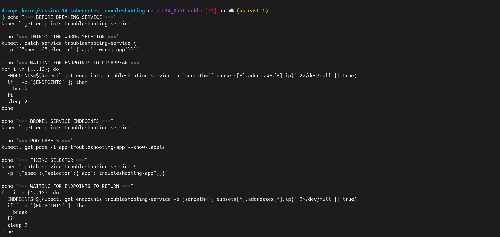
> 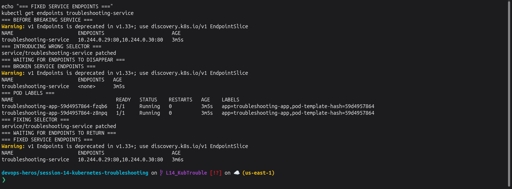

---

### Troubleshooting Table

| Problem | What I Saw | Command I Used | Root Cause | Fix |
| :--- | :--- | :--- | :--- | :--- |
| **Broken Pod** | `ImagePullBackOff` | `kubectl get` and Events | Invalid image tag | Changed to `nginx:1.27` |
| **Service Problem** | Endpoints showed `<none>` | `kubectl get endpoints` | Service selector did not match Pod labels | Corrected the selector |
| **Image Problem** | `ErrImagePull` / `ImagePullBackOff` | Pod Events | Image could not be downloaded | Used a valid image |

---

### QnA

1. **What does `kubectl get` tell us?**  
   It gives a quick view of Kubernetes resources and their current status.

2. **What is the difference between `get` and `describe`?**  
   `get` gives a short status, while `describe` gives detailed information and Events.

3. **Why do we use `kubectl logs`?**  
   To see the output and errors produced by an application inside a container.

4. **When would you use `kubectl exec`?**  
   When I need to run a command inside a running container.

5. **What does `CrashLoopBackOff` mean?**  
   The container keeps starting, crashing and being restarted by Kubernetes.

6. **What does `ImagePullBackOff` mean?**  
   Kubernetes cannot download the container image and keeps retrying.

7. **Why can a Pod remain `Pending`?**  
   Kubernetes may not be able to find a suitable node or required resources for it.

8. **Why can a Service have no endpoints?**  
   Its selector may not match the labels of any running Pods.

9. **What is the relationship between a Service selector and Pod labels?**  
   A Service uses its selector to find Pods having matching labels.

10. **What is Kubernetes DNS?**  
    It lets Pods access Services using names such as `web-service` instead of remembering IP addresses.

---

# Cleanup After Lecture 14

Sab clean karne ke liye :

```bash
echo "=== CLEANING LECTURE 14 RESOURCES ==="

kubectl delete pod get-demo --ignore-not-found

kubectl delete pod crash-demo --ignore-not-found
kubectl delete pod image-demo --ignore-not-found
kubectl delete pod pending-demo --ignore-not-found

kubectl delete pod dns-test --ignore-not-found
kubectl delete service broken-service --ignore-not-found
kubectl delete service web-service --ignore-not-found
kubectl delete deployment web --ignore-not-found

kubectl delete pod project-broken-pod --ignore-not-found
kubectl delete service troubleshooting-service --ignore-not-found
kubectl delete deployment troubleshooting-app --ignore-not-found

echo ""
echo "=== VERIFY L14 RESOURCES ARE REMOVED ==="

kubectl get pod get-demo crash-demo image-demo pending-demo dns-test project-broken-pod \
  --ignore-not-found

kubectl get deployment web troubleshooting-app \
  --ignore-not-found

kubectl get service web-service broken-service troubleshooting-service \
  --ignore-not-found

echo ""
echo "=== CLUSTER STATUS ==="
kubectl get nodes
```