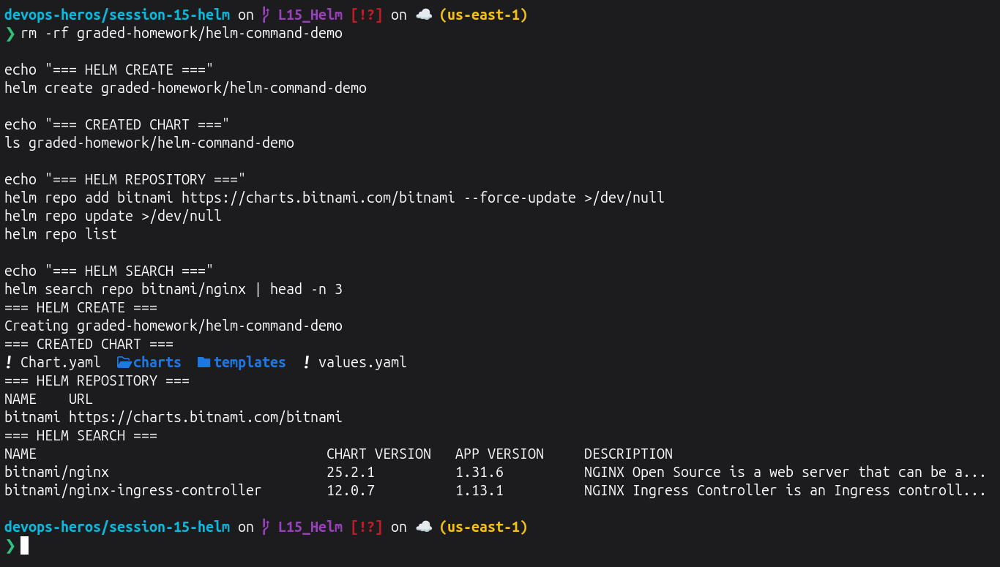
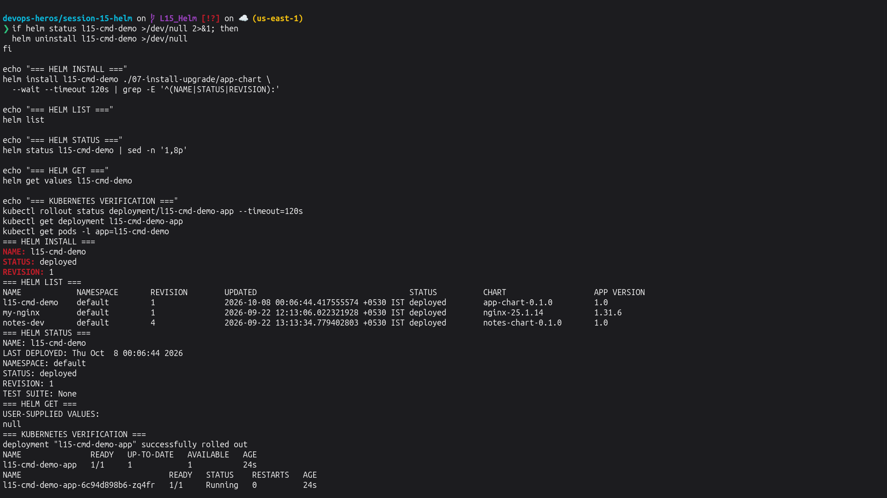
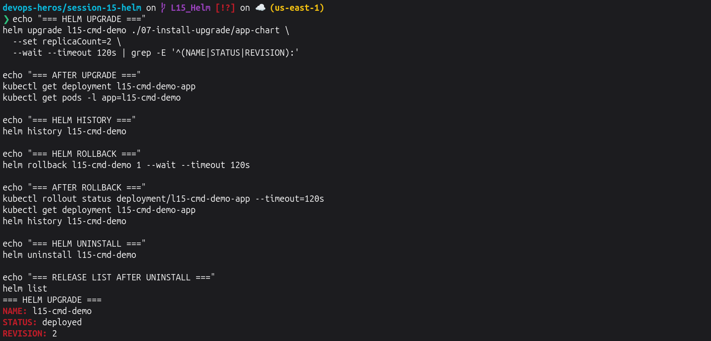
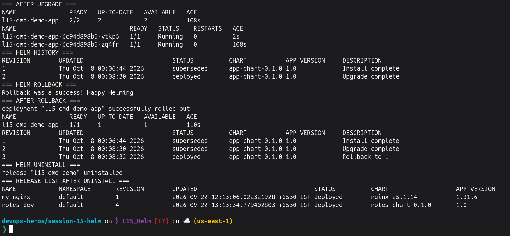
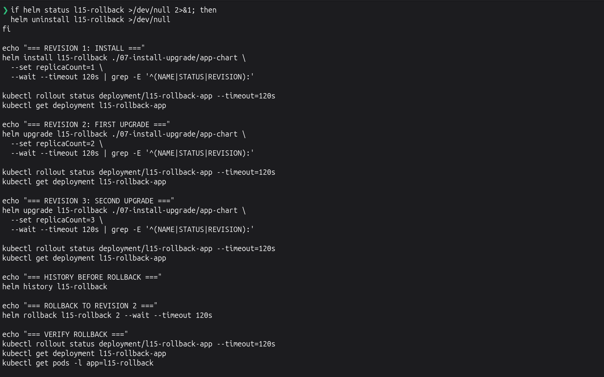
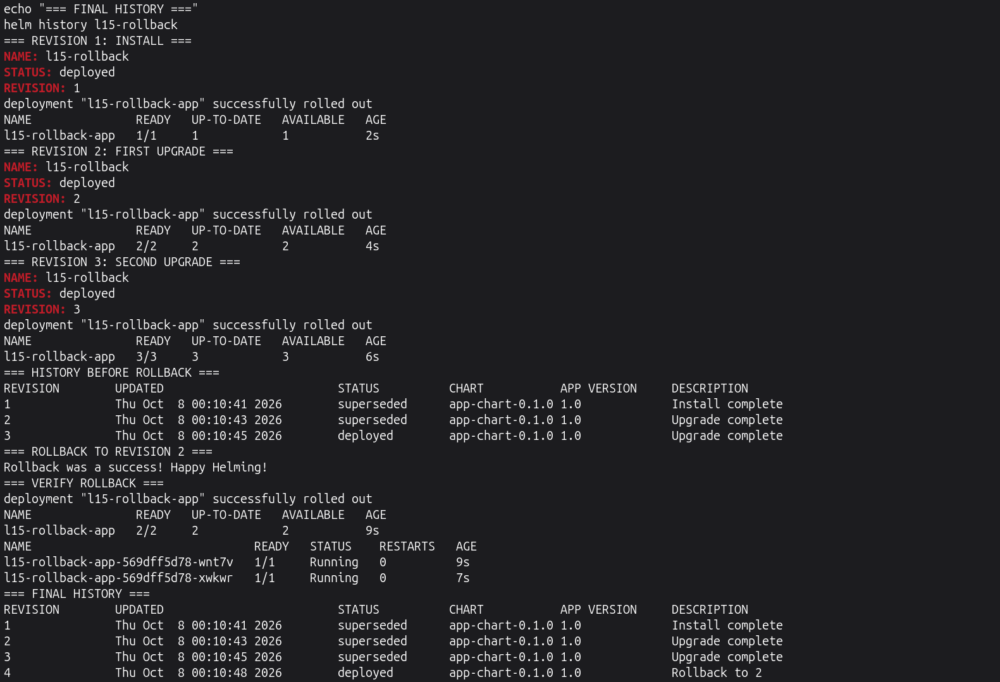
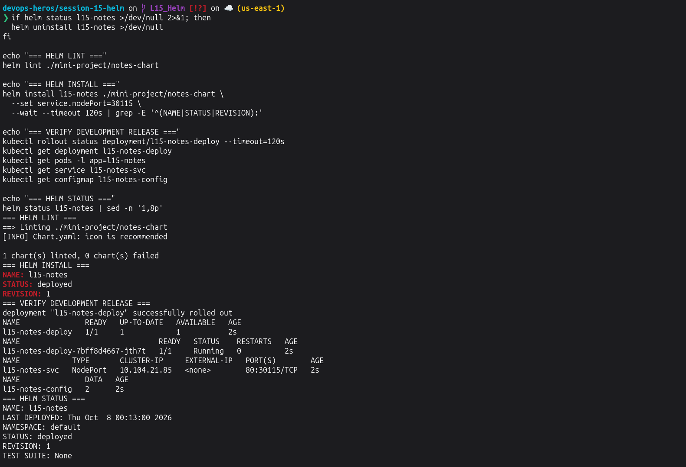
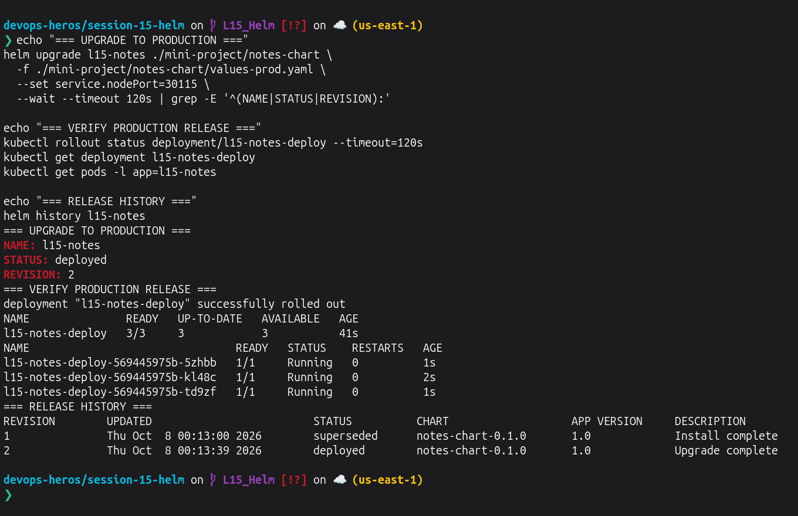
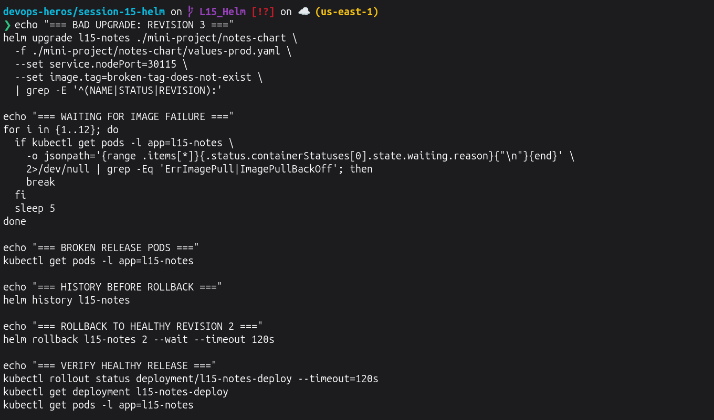
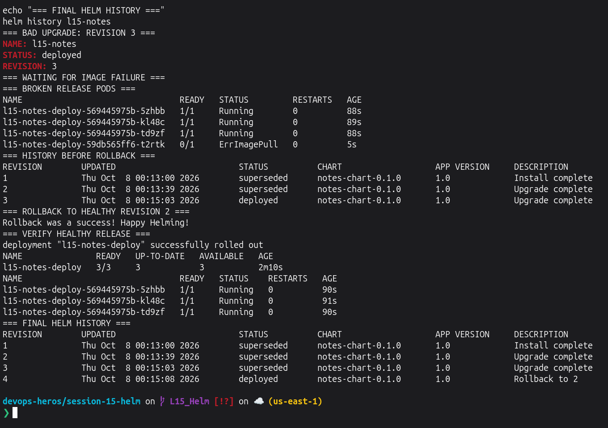

# Lecture 15 — Helm

## Short Description

This homework covers the main Helm workflow: creating charts, installing and managing releases, upgrading applications, checking revision history, rolling back releases, using Helm repositories, and completing the Notes App mini project. The assignment specifically requires practice with `helm create`, `install`, `list`, `status`, `get`, `upgrade`, `history`, `rollback`, `uninstall`, `repo`, and `search`.

---

## Environment Check

I ran this once before starting:

```bash
if ! command -v helm >/dev/null 2>&1; then
  curl -fsSL https://raw.githubusercontent.com/helm/helm/main/scripts/get-helm-3 | bash
fi

echo "=== HELM VERSION ==="
helm version --short

echo "=== KUBERNETES CLUSTER ==="
kubectl get nodes
```
---

# Task 1: Helm Commands

## Task 1.1 — `helm create`, `helm repo`, and `helm search`

```bash
rm -rf graded-homework/helm-command-demo

echo "=== HELM CREATE ==="
helm create graded-homework/helm-command-demo

echo "=== CREATED CHART ==="
ls graded-homework/helm-command-demo

echo "=== HELM REPOSITORY ==="
helm repo add bitnami https://charts.bitnami.com/bitnami --force-update >/dev/null
helm repo update >/dev/null
helm repo list

echo "=== HELM SEARCH ==="
helm search repo bitnami/nginx | head -n 3
```

**Screenshot:** 
> 

---

## Task 1.2 — Install, List, Status, and Get

The provided `app-chart` uses Nginx and supports `replicaCount` and image values. 

```bash
if helm status l15-cmd-demo >/dev/null 2>&1; then
  helm uninstall l15-cmd-demo >/dev/null
fi

echo "=== HELM INSTALL ==="
helm install l15-cmd-demo ./07-install-upgrade/app-chart \
  --wait --timeout 120s | grep -E '^(NAME|STATUS|REVISION):'

echo "=== HELM LIST ==="
helm list

echo "=== HELM STATUS ==="
helm status l15-cmd-demo | sed -n '1,8p'

echo "=== HELM GET ==="
helm get values l15-cmd-demo

echo "=== KUBERNETES VERIFICATION ==="
kubectl rollout status deployment/l15-cmd-demo-app --timeout=120s
kubectl get deployment l15-cmd-demo-app
kubectl get pods -l app=l15-cmd-demo
```

**Screenshot:**
> 

---

## Task 1.3 — Upgrade, History, Rollback, and Uninstall

```bash
echo "=== HELM UPGRADE ==="
helm upgrade l15-cmd-demo ./07-install-upgrade/app-chart \
  --set replicaCount=2 \
  --wait --timeout 120s | grep -E '^(NAME|STATUS|REVISION):'

echo "=== AFTER UPGRADE ==="
kubectl get deployment l15-cmd-demo-app
kubectl get pods -l app=l15-cmd-demo

echo "=== HELM HISTORY ==="
helm history l15-cmd-demo

echo "=== HELM ROLLBACK ==="
helm rollback l15-cmd-demo 1 --wait --timeout 120s

echo "=== AFTER ROLLBACK ==="
kubectl rollout status deployment/l15-cmd-demo-app --timeout=120s
kubectl get deployment l15-cmd-demo-app
helm history l15-cmd-demo

echo "=== HELM UNINSTALL ==="
helm uninstall l15-cmd-demo

echo "=== RELEASE LIST AFTER UNINSTALL ==="
helm list
```

**Screenshot:**
> 
> 

---

# Task 2: Helm Rollback Workflow

The required workflow is Install → Upgrade → Verify → Upgrade Again → Verify → Rollback → Verify.

I used replica changes for the upgrades so the complete rollback workflow can be demonstrated without intentionally causing command or image errors.

```bash
if helm status l15-rollback >/dev/null 2>&1; then
  helm uninstall l15-rollback >/dev/null
fi

echo "=== REVISION 1: INSTALL ==="
helm install l15-rollback ./07-install-upgrade/app-chart \
  --set replicaCount=1 \
  --wait --timeout 120s | grep -E '^(NAME|STATUS|REVISION):'

kubectl rollout status deployment/l15-rollback-app --timeout=120s
kubectl get deployment l15-rollback-app

echo "=== REVISION 2: FIRST UPGRADE ==="
helm upgrade l15-rollback ./07-install-upgrade/app-chart \
  --set replicaCount=2 \
  --wait --timeout 120s | grep -E '^(NAME|STATUS|REVISION):'

kubectl rollout status deployment/l15-rollback-app --timeout=120s
kubectl get deployment l15-rollback-app

echo "=== REVISION 3: SECOND UPGRADE ==="
helm upgrade l15-rollback ./07-install-upgrade/app-chart \
  --set replicaCount=3 \
  --wait --timeout 120s | grep -E '^(NAME|STATUS|REVISION):'

kubectl rollout status deployment/l15-rollback-app --timeout=120s
kubectl get deployment l15-rollback-app

echo "=== HISTORY BEFORE ROLLBACK ==="
helm history l15-rollback

echo "=== ROLLBACK TO REVISION 2 ==="
helm rollback l15-rollback 2 --wait --timeout 120s

echo "=== VERIFY ROLLBACK ==="
kubectl rollout status deployment/l15-rollback-app --timeout=120s
kubectl get deployment l15-rollback-app
kubectl get pods -l app=l15-rollback

echo "=== FINAL HISTORY ==="
helm history l15-rollback
```

**Screenshot:**
> 
> 

### Result

The release was first installed with one replica, upgraded to two replicas, upgraded again to three replicas, and finally rolled back to revision 2. Helm kept the complete revision history and restored the two-replica configuration successfully.

---

# Task 3: Helm Mini Project

## Notes App Helm Chart

The provided mini project contains the required Helm chart, development and production values, and Deployment, Service, and ConfigMap templates. 

```text
mini-project/notes-chart/
├── Chart.yaml
├── values.yaml
├── values-prod.yaml
└── templates/
    ├── configmap.yaml
    ├── deployment.yaml
    └── service.yaml
```

The development configuration uses one replica and Nginx `1.24`, while the production configuration uses three replicas and Nginx `1.25`.  

## Task 3.1 — Lint, Install and Verify

I used release name `l15-notes` to avoid conflicts with Kubernetes resources created in earlier lectures.

```bash
if helm status l15-notes >/dev/null 2>&1; then
  helm uninstall l15-notes >/dev/null
fi

echo "=== HELM LINT ==="
helm lint ./mini-project/notes-chart

echo "=== HELM INSTALL ==="
helm install l15-notes ./mini-project/notes-chart \
  --set service.nodePort=30115 \
  --wait --timeout 120s | grep -E '^(NAME|STATUS|REVISION):'

echo "=== VERIFY DEVELOPMENT RELEASE ==="
kubectl rollout status deployment/l15-notes-deploy --timeout=120s
kubectl get deployment l15-notes-deploy
kubectl get pods -l app=l15-notes
kubectl get service l15-notes-svc
kubectl get configmap l15-notes-config

echo "=== HELM STATUS ==="
helm status l15-notes | sed -n '1,8p'
```

**Screenshot:**
> 

---

## Task 3.2 — Upgrade to Production

```bash
echo "=== UPGRADE TO PRODUCTION ==="
helm upgrade l15-notes ./mini-project/notes-chart \
  -f ./mini-project/notes-chart/values-prod.yaml \
  --set service.nodePort=30115 \
  --wait --timeout 120s | grep -E '^(NAME|STATUS|REVISION):'

echo "=== VERIFY PRODUCTION RELEASE ==="
kubectl rollout status deployment/l15-notes-deploy --timeout=120s
kubectl get deployment l15-notes-deploy
kubectl get pods -l app=l15-notes

echo "=== RELEASE HISTORY ==="
helm history l15-notes
```

**Screenshot:**
> 

---

## Task 3.3 — Simulate Bad Upgrade and Rollback

The mini-project specifically requires simulating a bad image upgrade and then rolling back to the healthy production revision. 

```bash
echo "=== BAD UPGRADE: REVISION 3 ==="
helm upgrade l15-notes ./mini-project/notes-chart \
  -f ./mini-project/notes-chart/values-prod.yaml \
  --set service.nodePort=30115 \
  --set image.tag=broken-tag-does-not-exist \
  | grep -E '^(NAME|STATUS|REVISION):'

echo "=== WAITING FOR IMAGE FAILURE ==="
for i in {1..12}; do
  if kubectl get pods -l app=l15-notes \
    -o jsonpath='{range .items[*]}{.status.containerStatuses[0].state.waiting.reason}{"\n"}{end}' \
    2>/dev/null | grep -Eq 'ErrImagePull|ImagePullBackOff'; then
    break
  fi
  sleep 5
done

echo "=== BROKEN RELEASE PODS ==="
kubectl get pods -l app=l15-notes

echo "=== HISTORY BEFORE ROLLBACK ==="
helm history l15-notes

echo "=== ROLLBACK TO HEALTHY REVISION 2 ==="
helm rollback l15-notes 2 --wait --timeout 120s

echo "=== VERIFY HEALTHY RELEASE ==="
kubectl rollout status deployment/l15-notes-deploy --timeout=120s
kubectl get deployment l15-notes-deploy
kubectl get pods -l app=l15-notes

echo "=== FINAL HELM HISTORY ==="
helm history l15-notes
```

**Screenshot:**
> 
> 

### Result

The Notes App was installed using development values, upgraded to production values with three replicas, intentionally upgraded with an invalid image tag, and then successfully rolled back to the healthy production revision.

---

# Conclusion

In this session I practiced the complete Helm release lifecycle:

- Creating a Helm chart
- Working with Helm repositories
- Searching for charts
- Installing releases
- Listing and checking releases
- Reading release values
- Upgrading releases
- Viewing revision history
- Rolling back releases
- Uninstalling releases
- Deploying and managing an application using a Helm chart

---

# Cleanup After Lecture 15

```bash
echo "=== CLEANING LECTURE 15 RELEASES ==="

for release in l15-cmd-demo l15-rollback l15-notes; do
  if helm status "$release" >/dev/null 2>&1; then
    helm uninstall "$release"
  fi
done

rm -rf graded-homework/helm-command-demo

echo ""
echo "=== REMAINING HELM RELEASES ==="
helm list

echo ""
echo "=== VERIFY L15 WORKLOADS ARE REMOVED ==="
kubectl get deployment l15-cmd-demo-app l15-rollback-app l15-notes-deploy \
  --ignore-not-found

kubectl get service l15-notes-svc \
  --ignore-not-found

kubectl get pods \
  -l 'app in (l15-cmd-demo,l15-rollback,l15-notes)'

echo ""
echo "=== CLUSTER STATUS ==="
kubectl get nodes
```