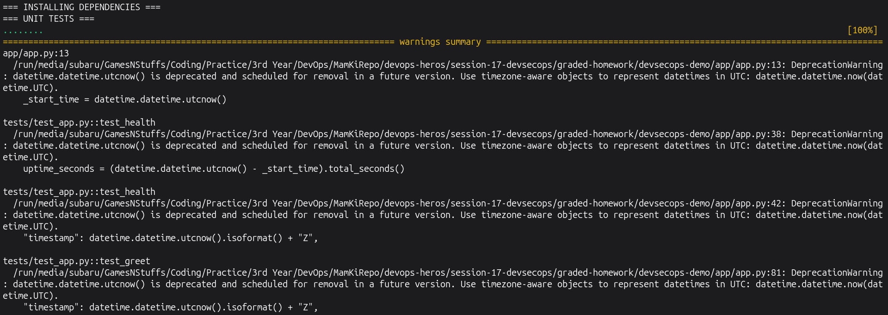
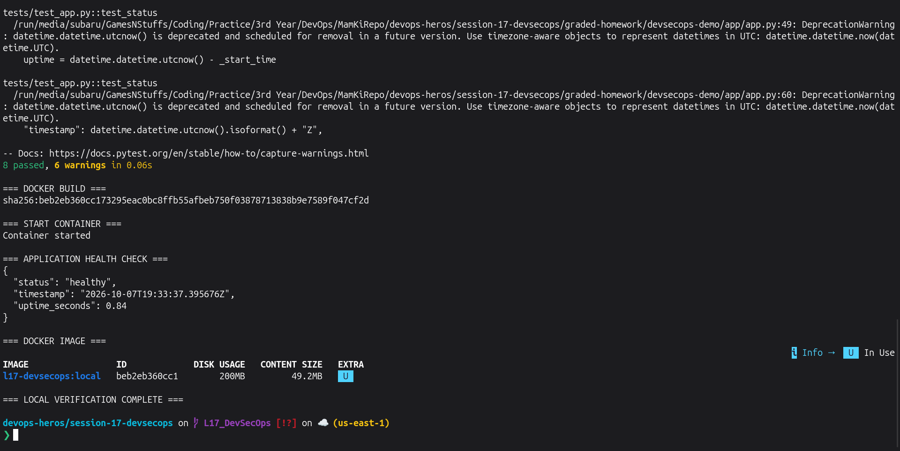

# Lecture 17 — Complete CI/CD & DevSecOps

## Short Description

This project implements a complete CI/CD and DevSecOps pipeline using GitHub Actions.

The pipeline covers:

```text
Code
  ↓
Application Build
  ↓
Unit Tests
  ↓
SAST
  ↓
SCA
  ↓
Secret Scanning
  ↓
Docker Build
  ↓
Container Image Scan
  ↓
Security Gate
  ↓
Push Image to Registry
  ↓
Deploy to Kubernetes
```

The application is a Flask-based DevSecOps dashboard with automated unit tests.

---

# Security Tools Used

| Security Area | Tool |
|---|---|
| SAST | GitHub CodeQL |
| SCA | pip-audit |
| Secret Scanning | detect-secrets |
| Container Image Scanning | Trivy |
| Security Gate | GitHub Actions pipeline gate |
| Container Registry | GitHub Container Registry |
| Kubernetes | Kind |

---

# Project Setup

Ran this entire block from:

```text
devops-heros/session-17-devsecops
```

```bash
echo "=== CREATING LECTURE 17 DEVSECOPS PROJECT ==="

rm -rf graded-homework/devsecops-demo
mkdir -p graded-homework/devsecops-demo/k8s

cp -r demo/app graded-homework/devsecops-demo/
cp -r demo/tests graded-homework/devsecops-demo/

cp demo/Dockerfile graded-homework/devsecops-demo/
cp demo/requirements.txt graded-homework/devsecops-demo/
cp demo/requirements-dev.txt graded-homework/devsecops-demo/
cp demo/pytest.ini graded-homework/devsecops-demo/
cp demo/SECURITY.md graded-homework/devsecops-demo/

cat > graded-homework/devsecops-demo/.gitignore <<'EOF'
.venv/
.venv-l17/
__pycache__/
.pytest_cache/
.coverage
secret-scan.json
EOF

cat > graded-homework/devsecops-demo/k8s/deployment.yaml <<'EOF'
apiVersion: apps/v1
kind: Deployment
metadata:
  name: l17-devsecops
spec:
  replicas: 2
  selector:
    matchLabels:
      app: l17-devsecops
  template:
    metadata:
      labels:
        app: l17-devsecops
    spec:
      containers:
        - name: l17-devsecops
          image: l17-devsecops:__IMAGE_TAG__
          imagePullPolicy: IfNotPresent
          ports:
            - containerPort: 5001
          readinessProbe:
            httpGet:
              path: /health
              port: 5001
            initialDelaySeconds: 2
            periodSeconds: 2
EOF

cat > graded-homework/devsecops-demo/k8s/service.yaml <<'EOF'
apiVersion: v1
kind: Service
metadata:
  name: l17-devsecops
spec:
  selector:
    app: l17-devsecops
  ports:
    - port: 80
      targetPort: 5001
  type: ClusterIP
EOF

mkdir -p ../.github/workflows

cat > ../.github/workflows/l17-devsecops.yml <<'EOF'
name: Lecture 17 DevSecOps Pipeline

on:
  push:
    branches:
      - L17_DevSecOps
    paths:
      - "session-17-devsecops/graded-homework/devsecops-demo/**"
      - ".github/workflows/l17-devsecops.yml"
  workflow_dispatch:

permissions:
  contents: read
  packages: write
  security-events: write

jobs:
  devsecops:
    name: Complete DevSecOps Pipeline
    runs-on: ubuntu-latest

    defaults:
      run:
        working-directory: session-17-devsecops/graded-homework/devsecops-demo

    steps:
      - name: Checkout source code
        uses: actions/checkout@v4

      - name: Setup Python
        uses: actions/setup-python@v5
        with:
          python-version: "3.12"

      - name: Install dependencies and security tools
        run: |
          python -m pip install --upgrade pip
          pip install -r requirements-dev.txt
          pip install pip-audit detect-secrets

      - name: Initialize CodeQL
        uses: github/codeql-action/init@v3
        with:
          languages: python

      - name: Application Build Check
        run: |
          python -m compileall app
          echo "Application build check passed"

      - name: Unit Tests
        run: |
          pytest --cov=app --cov-report=term-missing

      - name: SAST - CodeQL
        uses: github/codeql-action/analyze@v3

      - name: SCA - Dependency Scan
        run: |
          pip-audit -r requirements.txt

      - name: Secret Scan
        run: |
          detect-secrets scan \
            app tests k8s Dockerfile requirements.txt requirements-dev.txt \
            > secret-scan.json

          python - <<'PY'
          import json

          with open("secret-scan.json") as f:
              report = json.load(f)

          count = sum(len(items) for items in report.get("results", {}).values())

          print(f"Potential secrets found: {count}")

          if count != 0:
              raise SystemExit("Secret scanning gate failed")

          print("Secret scanning passed")
          PY

      - name: Build Docker Image
        run: |
          docker build -t l17-devsecops:${GITHUB_SHA} .

      - name: Container Image Scan - Trivy
        uses: aquasecurity/trivy-action@v0.36.0
        with:
          image-ref: "l17-devsecops:${{ github.sha }}"
          format: "table"
          severity: "CRITICAL"
          ignore-unfixed: true
          exit-code: "1"

      - name: Security Gate
        run: |
          echo "===================================="
          echo "SECURITY GATE PASSED"
          echo "Unit Tests       : PASSED"
          echo "SAST             : PASSED"
          echo "SCA              : PASSED"
          echo "Secret Scan      : PASSED"
          echo "Container Scan   : PASSED"
          echo "===================================="

      - name: Generate GHCR Image Name
        id: image
        run: |
          OWNER=$(echo "${GITHUB_REPOSITORY_OWNER}" | tr '[:upper:]' '[:lower:]')
          echo "name=ghcr.io/${OWNER}/l17-devsecops" >> "$GITHUB_OUTPUT"

      - name: Login to GitHub Container Registry
        uses: docker/login-action@v3
        with:
          registry: ghcr.io
          username: ${{ github.actor }}
          password: ${{ secrets.GITHUB_TOKEN }}

      - name: Push Image to Registry
        run: |
          docker tag \
            l17-devsecops:${GITHUB_SHA} \
            "${{ steps.image.outputs.name }}:${GITHUB_SHA}"

          docker tag \
            l17-devsecops:${GITHUB_SHA} \
            "${{ steps.image.outputs.name }}:latest"

          docker push "${{ steps.image.outputs.name }}:${GITHUB_SHA}"
          docker push "${{ steps.image.outputs.name }}:latest"

          echo "Image pushed successfully:"
          echo "${{ steps.image.outputs.name }}:${GITHUB_SHA}"

      - name: Create Kubernetes Cluster
        uses: helm/kind-action@v1.10.0

      - name: Load Scanned Image into Kubernetes
        run: |
          CLUSTER=$(kind get clusters | head -n 1)
          echo "Kind cluster: ${CLUSTER}"

          kind load docker-image \
            l17-devsecops:${GITHUB_SHA} \
            --name "${CLUSTER}"

      - name: Prepare Kubernetes Manifest
        run: |
          sed -i \
            "s|__IMAGE_TAG__|${GITHUB_SHA}|g" \
            k8s/deployment.yaml

          grep "image:" k8s/deployment.yaml

      - name: Deploy to Kubernetes
        run: |
          kubectl apply -f k8s/deployment.yaml
          kubectl apply -f k8s/service.yaml

          kubectl rollout status \
            deployment/l17-devsecops \
            --timeout=120s

      - name: Verify Kubernetes Deployment
        run: |
          echo "=== PODS ==="
          kubectl get pods -l app=l17-devsecops -o wide

          echo "=== DEPLOYMENT ==="
          kubectl get deployment l17-devsecops

          echo "=== SERVICE ==="
          kubectl get service l17-devsecops

      - name: Test Deployed Application
        run: |
          kubectl port-forward service/l17-devsecops 5017:80 \
            >/tmp/l17-port-forward.log 2>&1 &

          PF_PID=$!

          SUCCESS=0

          for i in {1..20}; do
            if RESPONSE=$(curl -fsS http://127.0.0.1:5017/health); then
              echo "=== APPLICATION HEALTH ==="
              echo "${RESPONSE}"
              SUCCESS=1
              break
            fi

            sleep 1
          done

          kill ${PF_PID} 2>/dev/null || true

          if [ "${SUCCESS}" -ne 1 ]; then
            cat /tmp/l17-port-forward.log
            exit 1
          fi

          echo "Kubernetes deployment verification passed"
EOF

echo ""
echo "=== PROJECT FILES ==="
find graded-homework/devsecops-demo -maxdepth 3 -type f | sort

echo ""
echo "=== WORKFLOW ==="
test -f ../.github/workflows/l17-devsecops.yml && \
  echo "Lecture 17 GitHub Actions workflow created successfully"
```

---

# Application

The project uses a Flask application that provides:

- Dashboard page
- Health endpoint
- Application status endpoint
- Greeting API
- Calculator API
- CI/CD pipeline simulator

The application listens on port `5001`.

---

# Docker Image

The application is packaged using Docker.

The Dockerfile:

```text
Python Base Image
      ↓
Install Dependencies
      ↓
Copy Application
      ↓
Expose Port 5001
      ↓
Start Flask Application
```

---

# Kubernetes Deployment

The Kubernetes configuration contains:

```text
Deployment
  ├── 2 replicas
  ├── DevSecOps application
  └── Readiness probe

Service
  └── Routes port 80 → container port 5001
```

The same scanned Docker image is loaded into the temporary Kind cluster for deployment verification.

---

# Local Verification

Ran this entire block:

```bash
cd graded-homework/devsecops-demo

rm -rf .venv-l17

python3 -m venv .venv-l17
source .venv-l17/bin/activate

echo "=== INSTALLING DEPENDENCIES ==="
python -m pip install --upgrade pip >/dev/null
pip install -r requirements-dev.txt >/dev/null

echo "=== UNIT TESTS ==="
python -m pytest -q

echo ""
echo "=== DOCKER BUILD ==="
docker build -q -t l17-devsecops:local .

echo ""
echo "=== START CONTAINER ==="
docker rm -f l17-devsecops-local 2>/dev/null || true

docker run -d \
  --name l17-devsecops-local \
  -p 5017:5001 \
  l17-devsecops:local >/dev/null

echo "Container started"

echo ""
echo "=== APPLICATION HEALTH CHECK ==="

SUCCESS=0

for i in {1..20}; do
  if RESPONSE=$(curl -fsS http://127.0.0.1:5017/health 2>/dev/null); then
    echo "$RESPONSE"
    SUCCESS=1
    break
  fi
  sleep 1
done

if [ "$SUCCESS" -ne 1 ]; then
  docker logs l17-devsecops-local
  exit 1
fi

echo ""
echo "=== DOCKER IMAGE ==="
docker images l17-devsecops:local

docker rm -f l17-devsecops-local >/dev/null

deactivate
cd ../..

echo ""
echo "=== LOCAL VERIFICATION COMPLETE ==="
```

**Screenshot:**
> 
> 

---

# Unit Testing

The pipeline runs the automated tests using:

```text
pytest
pytest-cov
```

The unit tests verify the Flask application's API behaviour before the application can continue further into the pipeline.

---

# SAST — Static Application Security Testing

SAST scans the application's source code without needing the application to run.

This project uses:

```text
GitHub CodeQL
```

CodeQL analyzes the Python source code for security weaknesses.

---

# SCA — Software Composition Analysis

SCA checks third-party dependencies for known vulnerabilities.

This project uses:

```text
pip-audit
```

It scans the dependencies declared in `requirements.txt`.

---

# Secret Scanning

The project uses:

```text
detect-secrets
```

The scanner checks the project files for possible API keys, passwords, tokens and other sensitive values.

If a possible secret is found, the pipeline stops before the Docker image can be released.

---

# Container Image Scanning

The Docker image is scanned using:

```text
Trivy
```

Trivy checks the built container image for known vulnerabilities.

The pipeline is configured to block the release when a **CRITICAL** vulnerability that is not ignored by the configured policy is detected.

---

# Security Gate

The security gate is reached only after:

```text
Unit Tests
    ✓
SAST
    ✓
SCA
    ✓
Secret Scan
    ✓
Container Scan
    ✓
Security Gate
```

If a blocking stage fails, image publishing and deployment do not continue.

---

# Container Registry

The scanned Docker image is pushed to:

```text
GitHub Container Registry (GHCR)
```

The workflow publishes:

```text
ghcr.io/<github-user>/l17-devsecops:<commit-sha>
ghcr.io/<github-user>/l17-devsecops:latest
```

The registry authentication uses the automatically generated:

```text
GITHUB_TOKEN
```

No Docker Hub credentials are stored in the repository.

---

# Push and Execute Pipeline

Ran this from:

```text
session-17-devsecops
```

```bash
echo "=== CURRENT BRANCH ==="
git branch --show-current

echo ""
echo "=== ADDING LECTURE 17 FILES ==="

git add graded-homework
git add ../.github/workflows/l17-devsecops.yml

git status --short

echo ""
echo "=== COMMIT ==="

if ! git diff --cached --quiet; then
  git commit -m "Complete Lecture 17 DevSecOps homework"
else
  echo "No new staged changes to commit"
fi

echo ""
echo "=== PUSH ==="

git push origin L17_DevSecOps

echo ""
echo "=== PUSH COMPLETE ==="
git log -1 --oneline
```

---

# Successful DevSecOps Pipeline

## GitHub Screenshot 1 — Successful Workflow

**This screenshot must be taken from GitHub, not the terminal.**

After pushing:

1. Open the repository on GitHub.
2. Open **Actions**.
3. Select **Lecture 17 DevSecOps Pipeline**.
4. Open the latest run.
5. Wait until `Complete DevSecOps Pipeline` is green.

**Screenshot:** Take one screenshot showing the successful workflow run.

> 

---

# Security Pipeline Result

## GitHub Screenshot 2 — Security Stages

Still on GitHub:

1. Open the successful workflow run.
2. Open **Complete DevSecOps Pipeline**.
3. Capture the section containing the security steps.

It should show successful steps for:

```text
Unit Tests
SAST - CodeQL
SCA - Dependency Scan
Secret Scan
Build Docker Image
Container Image Scan - Trivy
Security Gate
```

**Screenshot:** Take a GitHub screenshot with these steps showing green check marks.

> 

---

# Registry Result

## GitHub Screenshot 3 — GHCR Package

**This screenshot is also from GitHub.**

After the successful pipeline:

1. Open your repository on GitHub.
2. Look for **Packages** on the repository/profile page.
3. Open the `l17-devsecops` package.

If it is not shown directly on the repository page:

```text
GitHub Profile
→ Packages
→ l17-devsecops
```

You should see the container package created by the workflow.

**Screenshot:** Take one screenshot showing the `l17-devsecops` package/image.

> 

---

# Kubernetes Deployment Result

## GitHub Screenshot 4 — Kubernetes Deployment

From the same successful Actions job, scroll near the bottom.

Capture these successful steps:

```text
Create Kubernetes Cluster
Load Scanned Image into Kubernetes
Deploy to Kubernetes
Verify Kubernetes Deployment
Test Deployed Application
```

Expand **Verify Kubernetes Deployment** or **Test Deployed Application** so the screenshot shows:

```text
2 running Pods
Deployment available
Service created
healthy application response
```

**Screenshot:** This is from **GitHub Actions job logs**, not your local terminal.

> 

---

# Complete DevSecOps Flow

```text
Developer Push
      ↓
GitHub Actions
      ↓
Application Build
      ↓
Unit Testing
      ↓
CodeQL SAST
      ↓
pip-audit SCA
      ↓
Secret Scanning
      ↓
Docker Image Build
      ↓
Trivy Container Scan
      ↓
Security Gate
      ↓
GitHub Container Registry
      ↓
Kind Kubernetes Cluster
      ↓
Deployment
      ↓
Health Check
```

---

# Result

The complete DevSecOps pipeline successfully:

- Built the application
- Ran unit tests
- Performed SAST
- Performed dependency scanning
- Performed secret scanning
- Built a Docker image
- Scanned the container image
- Applied a security gate
- Pushed the approved image to a container registry
- Created a Kubernetes cluster
- Deployed the application
- Verified the Pods and Service
- Confirmed application health

---

# Conclusion

In this lecture I practiced integrating security directly into CI/CD instead of treating security as a separate final step.

The final pipeline automatically checks the application, dependencies, secrets and container image before allowing the image to be published and deployed.

---

# Cleanup After Lecture 17

The Kubernetes cluster created by GitHub Actions is temporary and is automatically destroyed with the GitHub-hosted runner, so **there is no local Kubernetes cleanup required**.

Do **not** delete the GHCR package because it is useful evidence for the assignment.

Run this local cleanup block after taking your terminal screenshot:

```bash
echo "=== LECTURE 17 LOCAL CLEANUP ==="

docker rm -f l17-devsecops-local 2>/dev/null || true
docker image rm l17-devsecops:local 2>/dev/null || true

rm -rf graded-homework/devsecops-demo/.venv-l17
rm -f graded-homework/devsecops-demo/.coverage
rm -f graded-homework/devsecops-demo/secret-scan.json

echo ""
echo "=== VERIFY LOCAL IMAGE REMOVED ==="
docker images l17-devsecops:local

echo ""
echo "=== CLEANUP COMPLETE ==="
```