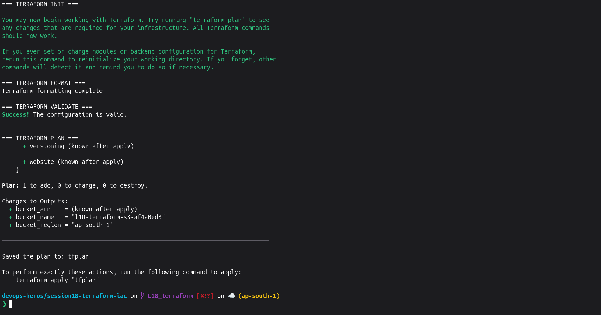
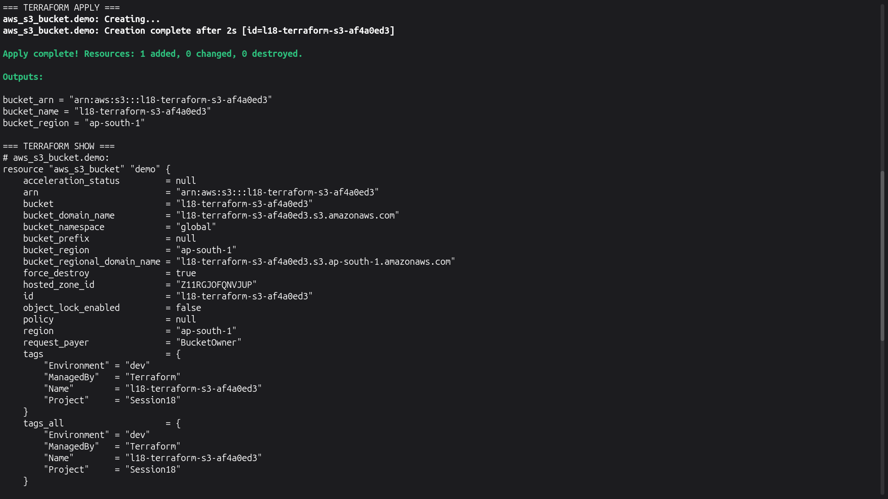
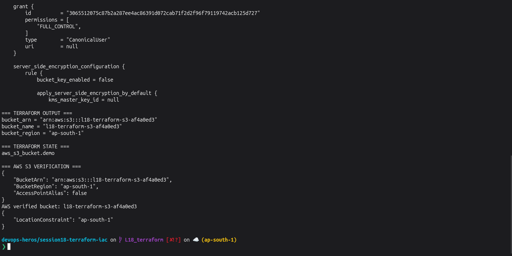
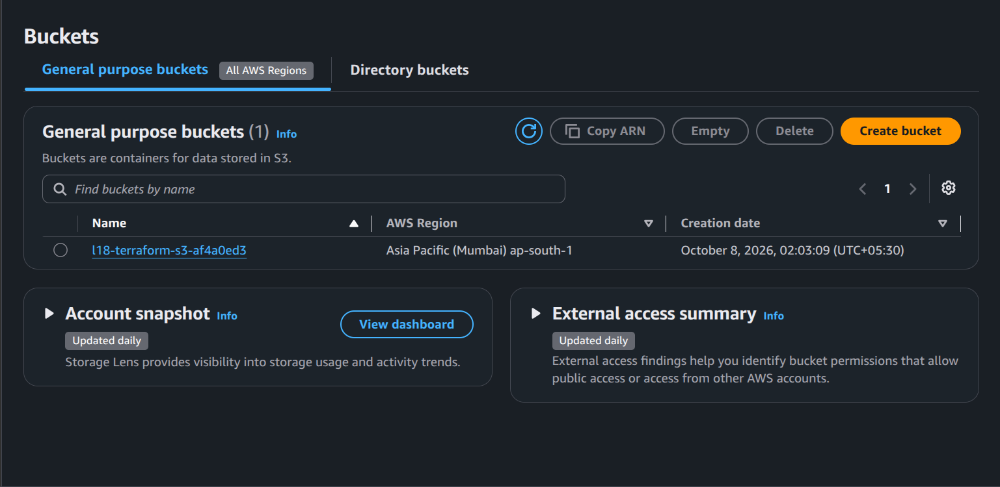
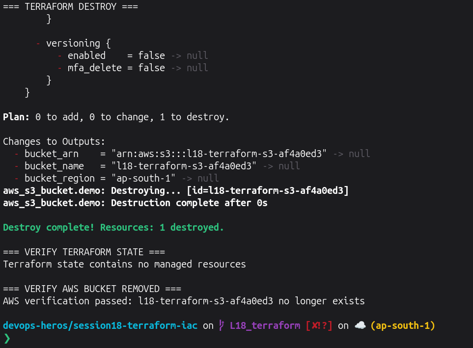

# Lecture 18 Graded Homework

## Task 1 — Terraform S3 Demo

### Project Structure

```text
terraform-s3-demo/
├── main.tf
├── variables.tf
├── outputs.tf
├── provider.tf
├── terraform.tfvars
├── README.md
└── .gitignore
```

Terraform is used to declare and manage an AWS S3 bucket as Infrastructure as Code.

---

## Task 1.1 — Prepare Terraform Project

Ran this from:

```text
session18-terraform-iac
```

```bash
set -e

echo "=== PREPARING TERRAFORM PROJECT ==="

rm -f terraform-s3-demo/providers.tf
rm -f terraform-s3-demo/terraform.tf

cat > terraform-s3-demo/provider.tf <<'EOF'
terraform {
  required_version = ">= 1.6.0"

  required_providers {
    aws = {
      source  = "hashicorp/aws"
      version = "~> 6.0"
    }
  }
}

provider "aws" {
  region = var.aws_region
}
EOF

cat > terraform-s3-demo/variables.tf <<'EOF'
variable "aws_region" {
  type        = string
  description = "AWS region where the S3 bucket will be created."
  default     = "ap-south-1"
}

variable "bucket_name" {
  type        = string
  description = "Globally unique name of the S3 bucket."
}
EOF

cat > terraform-s3-demo/main.tf <<'EOF'
resource "aws_s3_bucket" "demo" {
  bucket        = var.bucket_name
  force_destroy = true

  tags = {
    Name        = var.bucket_name
    Environment = "dev"
    ManagedBy   = "Terraform"
    Project     = "Session18"
  }
}
EOF

cat > terraform-s3-demo/outputs.tf <<'EOF'
output "bucket_name" {
  description = "Name of the S3 bucket."
  value       = aws_s3_bucket.demo.bucket
}

output "bucket_arn" {
  description = "ARN of the S3 bucket."
  value       = aws_s3_bucket.demo.arn
}

output "bucket_region" {
  description = "AWS region of the S3 bucket."
  value       = var.aws_region
}
EOF

if [ ! -f terraform-s3-demo/terraform.tfvars ]; then
  SUFFIX=$(cut -d- -f1 /proc/sys/kernel/random/uuid)

  cat > terraform-s3-demo/terraform.tfvars <<EOF
aws_region  = "ap-south-1"
bucket_name = "l18-terraform-s3-${SUFFIX}"
EOF
fi

if ! grep -qx '!terraform.tfvars' terraform-s3-demo/.gitignore; then
  printf '\n# Required non-secret classroom variable file\n!terraform.tfvars\n' \
    >> terraform-s3-demo/.gitignore
fi

echo ""
echo "=== PROJECT STRUCTURE ==="
find terraform-s3-demo -maxdepth 1 -type f \
  ! -name '.terraform.lock.hcl' \
  | sort

echo ""
echo "=== TERRAFORM VARIABLES ==="
cat terraform-s3-demo/terraform.tfvars

echo ""
echo "=== AWS IDENTITY VERIFIED ==="
aws sts get-caller-identity --query Arn --output text
```

The bucket name gets a random suffix because S3 bucket names must be globally unique.

---

## Task 1.2 — Init, Format, Validate and Plan

```bash
set -e

cd terraform-s3-demo

echo "=== TERRAFORM INIT ==="
terraform init -input=false >/tmp/l18-init.txt
tail -n 8 /tmp/l18-init.txt

echo ""
echo "=== TERRAFORM FORMAT ==="
terraform fmt
echo "Terraform formatting complete"

echo ""
echo "=== TERRAFORM VALIDATE ==="
terraform validate

echo ""
echo "=== TERRAFORM PLAN ==="
terraform plan \
  -input=false \
  -out=tfplan \
  >/tmp/l18-plan.txt

tail -n 18 /tmp/l18-plan.txt

cd ..
```

**Screenshot:**
> 

---

## Task 1.3 — Apply, Show and Output

```bash
set -e

cd terraform-s3-demo

echo "=== TERRAFORM APPLY ==="

terraform apply \
  -input=false \
  -auto-approve \
  tfplan \
  >/tmp/l18-apply.txt

tail -n 18 /tmp/l18-apply.txt

echo ""
echo "=== TERRAFORM SHOW ==="
terraform show -no-color | sed -n '1,45p'

echo ""
echo "=== TERRAFORM OUTPUT ==="
terraform output

echo ""
echo "=== TERRAFORM STATE ==="
terraform state list

BUCKET=$(terraform output -raw bucket_name)

echo ""
echo "=== AWS S3 VERIFICATION ==="

aws s3api head-bucket --bucket "$BUCKET"

echo "AWS verified bucket: $BUCKET"

aws s3api get-bucket-location \
  --bucket "$BUCKET"

cd ..
```

**Screenshot:**
> 
> 

---

## AWS Console Verification


---

## Task 1.4 — Terraform Destroy

After my AWS screenshot was saved, I ran:

```bash
set -e

cd terraform-s3-demo

BUCKET=$(terraform output -raw bucket_name)

echo "=== TERRAFORM DESTROY ==="

terraform destroy \
  -input=false \
  -auto-approve \
  >/tmp/l18-destroy.txt

tail -n 18 /tmp/l18-destroy.txt

echo ""
echo "=== VERIFY TERRAFORM STATE ==="

if [ -z "$(terraform state list)" ]; then
  echo "Terraform state contains no managed resources"
else
  terraform state list
  exit 1
fi

echo ""
echo "=== VERIFY AWS BUCKET REMOVED ==="

if aws s3api head-bucket \
  --bucket "$BUCKET" \
  >/dev/null 2>&1; then

  echo "Bucket still exists"
  exit 1
else
  echo "AWS verification passed: $BUCKET no longer exists"
fi

cd ..
```

**Screenshot:**


---

## Terraform Workflow

```text
Terraform Files
      ↓
terraform init
      ↓
terraform fmt
      ↓
terraform validate
      ↓
terraform plan
      ↓
terraform apply
      ↓
AWS S3 Bucket
      ↓
terraform show
      ↓
terraform output
      ↓
terraform destroy
```

---

# Task 2 — AWS Services Research

Separate notes were created for:

- [IAM — Governance](../aws-services/01-iam/README.md)
- [EC2 — Compute](../aws-services/02-ec2/README.md)
- [S3 — Storage](../aws-services/03-s3/README.md)
- [VPC — Networking](../aws-services/04-vpc/README.md)
- [DynamoDB & RDS — Databases](../aws-services/05-dynamodb-rds/README.md)

---

# What I Practiced

- Infrastructure as Code
- Terraform providers
- Terraform resources
- Variables and `.tfvars`
- Terraform outputs
- Terraform state
- `terraform init`
- `terraform fmt`
- `terraform validate`
- `terraform plan`
- `terraform apply`
- `terraform show`
- `terraform output`
- `terraform destroy`
- AWS S3
- IAM
- EC2
- VPC
- DynamoDB
- RDS


# Cleanup

The important cleanup is already performed by **Task 1.4 `terraform destroy`**.

Afterwards I removed only the local Terraform working files:

```bash
echo "=== LOCAL TERRAFORM CLEANUP ==="

rm -rf terraform-s3-demo/.terraform
rm -f terraform-s3-demo/tfplan
rm -f terraform-s3-demo/*.tfstate
rm -f terraform-s3-demo/*.tfstate.*

echo "Local Terraform runtime files removed"

echo ""
echo "=== AWS INFRASTRUCTURE ==="
echo "Lecture 18 S3 bucket was already destroyed by Terraform"
```