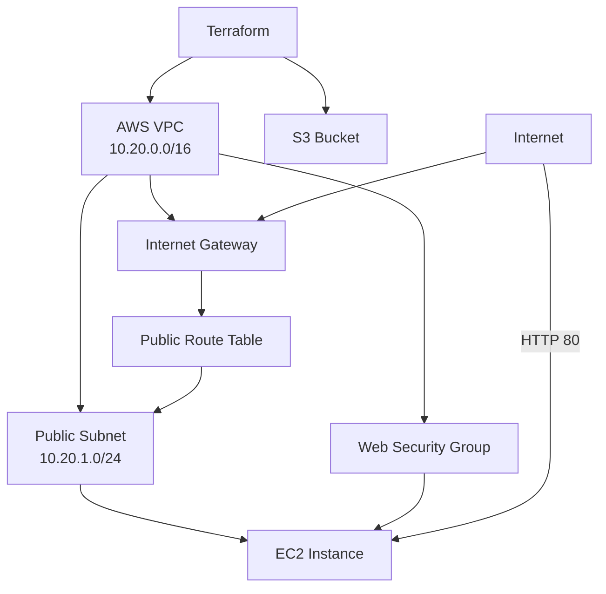
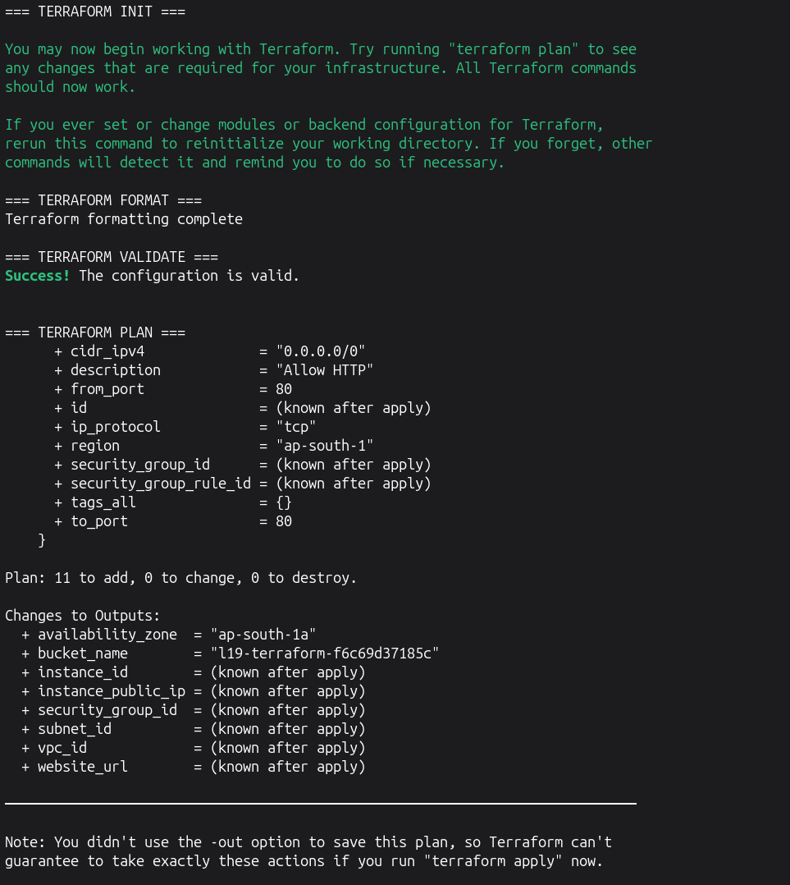
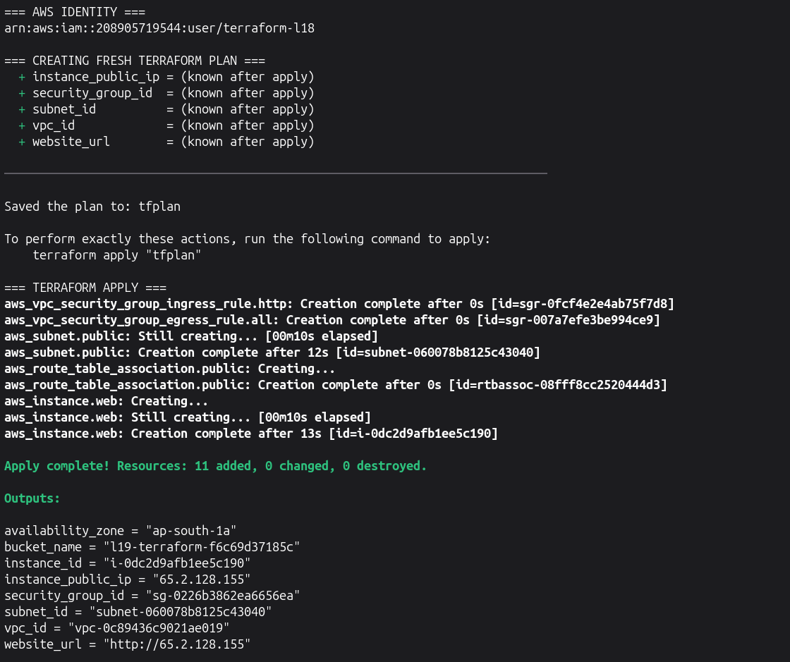
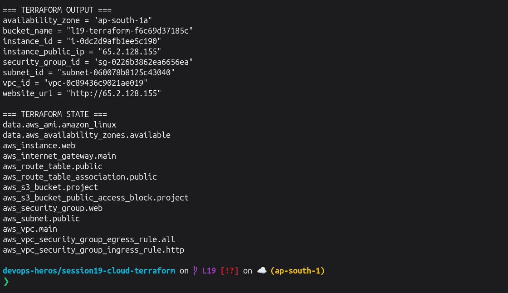
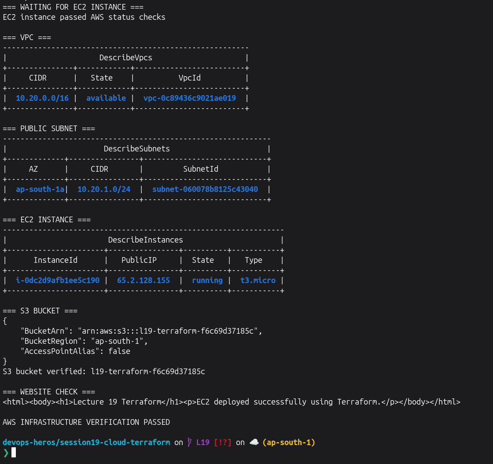
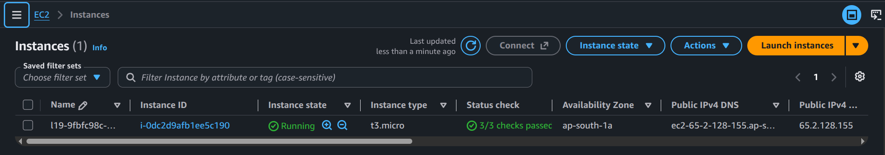
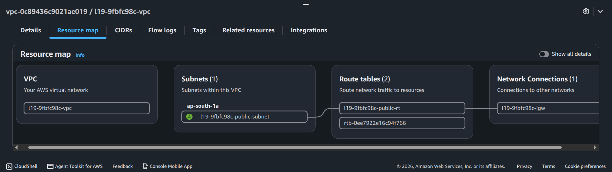
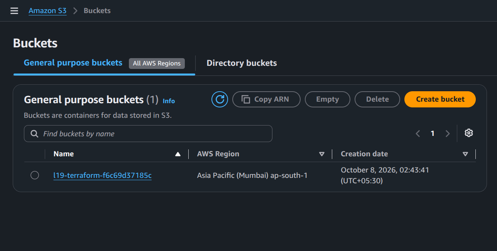
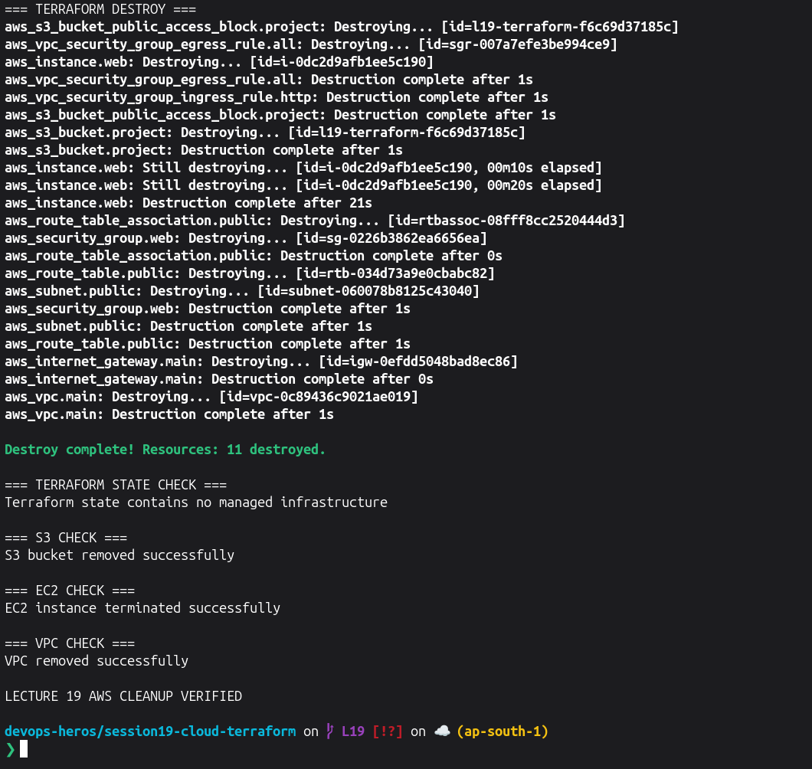

# Lecture 19 — Graded Homework

## Project Overview

This project uses Terraform to create an end-to-end AWS infrastructure environment.

The project demonstrates:

- Terraform provider
- Variables
- Resources
- Outputs
- Resource dependencies
- Terraform state
- AWS VPC networking
- EC2 compute
- S3 storage
- `terraform plan`
- `terraform apply`
- `terraform destroy`

---

# Architecture



The EC2 instance is placed in the public subnet and uses the web security group. S3 is managed independently by the same Terraform project.

---

# Project Structure

```text
graded-homework/
├── README.md
└── terraform-cloud-project/
    ├── versions.tf
    ├── variables.tf
    ├── terraform.tfvars
    ├── main.tf
    ├── outputs.tf
    └── .gitignore
```

---

# Task 1 — Create Terraform Project

Ran this entire block from:

```text
devops-heros/session19-cloud-terraform
```

```bash
set -e

echo "=== CREATING LECTURE 19 PROJECT ==="

rm -rf graded-homework/terraform-cloud-project
mkdir -p graded-homework/terraform-cloud-project

PROJECT_SUFFIX=$(cut -d- -f1 /proc/sys/kernel/random/uuid)
BUCKET_SUFFIX=$(tr -d '-' < /proc/sys/kernel/random/uuid | cut -c1-12)

cat > graded-homework/terraform-cloud-project/versions.tf <<'EOF'
terraform {
  required_version = ">= 1.6.0"

  required_providers {
    aws = {
      source  = "hashicorp/aws"
      version = "~> 6.0"
    }
  }
}

provider "aws" {
  region = var.aws_region
}
EOF

cat > graded-homework/terraform-cloud-project/variables.tf <<'EOF'
variable "aws_region" {
  description = "AWS region for the Lecture 19 project."
  type        = string
  default     = "ap-south-1"
}

variable "project_name" {
  description = "Name prefix used for AWS resources."
  type        = string
}

variable "bucket_name" {
  description = "Globally unique S3 bucket name."
  type        = string
}

variable "instance_type" {
  description = "EC2 instance type."
  type        = string
  default     = "t3.micro"
}
EOF

cat > graded-homework/terraform-cloud-project/terraform.tfvars <<EOF
aws_region    = "ap-south-1"
project_name  = "l19-${PROJECT_SUFFIX}"
bucket_name   = "l19-terraform-${BUCKET_SUFFIX}"
instance_type = "t3.micro"
EOF

cat > graded-homework/terraform-cloud-project/main.tf <<'EOF'
data "aws_availability_zones" "available" {
  state = "available"
}

data "aws_ami" "amazon_linux" {
  most_recent = true
  owners      = ["amazon"]

  filter {
    name   = "name"
    values = ["al2023-ami-2023.*-x86_64"]
  }

  filter {
    name   = "architecture"
    values = ["x86_64"]
  }

  filter {
    name   = "root-device-type"
    values = ["ebs"]
  }

  filter {
    name   = "virtualization-type"
    values = ["hvm"]
  }
}

resource "aws_vpc" "main" {
  cidr_block           = "10.20.0.0/16"
  enable_dns_support   = true
  enable_dns_hostnames = true

  tags = {
    Name      = "${var.project_name}-vpc"
    Session   = "19"
    ManagedBy = "Terraform"
  }
}

resource "aws_subnet" "public" {
  vpc_id                  = aws_vpc.main.id
  cidr_block              = "10.20.1.0/24"
  availability_zone       = data.aws_availability_zones.available.names[0]
  map_public_ip_on_launch = true

  tags = {
    Name      = "${var.project_name}-public-subnet"
    Session   = "19"
    ManagedBy = "Terraform"
  }
}

resource "aws_internet_gateway" "main" {
  vpc_id = aws_vpc.main.id

  tags = {
    Name      = "${var.project_name}-igw"
    Session   = "19"
    ManagedBy = "Terraform"
  }
}

resource "aws_route_table" "public" {
  vpc_id = aws_vpc.main.id

  route {
    cidr_block = "0.0.0.0/0"
    gateway_id = aws_internet_gateway.main.id
  }

  tags = {
    Name      = "${var.project_name}-public-rt"
    Session   = "19"
    ManagedBy = "Terraform"
  }
}

resource "aws_route_table_association" "public" {
  subnet_id      = aws_subnet.public.id
  route_table_id = aws_route_table.public.id
}

resource "aws_security_group" "web" {
  name        = "${var.project_name}-web-sg"
  description = "Lecture 19 HTTP security group"
  vpc_id      = aws_vpc.main.id

  tags = {
    Name      = "${var.project_name}-web-sg"
    Session   = "19"
    ManagedBy = "Terraform"
  }
}

resource "aws_vpc_security_group_ingress_rule" "http" {
  security_group_id = aws_security_group.web.id
  cidr_ipv4         = "0.0.0.0/0"
  from_port         = 80
  to_port           = 80
  ip_protocol       = "tcp"

  description = "Allow HTTP"
}

resource "aws_vpc_security_group_egress_rule" "all" {
  security_group_id = aws_security_group.web.id
  cidr_ipv4         = "0.0.0.0/0"
  ip_protocol       = "-1"

  description = "Allow outbound traffic"
}

resource "aws_instance" "web" {
  ami                         = data.aws_ami.amazon_linux.id
  instance_type               = var.instance_type
  subnet_id                   = aws_subnet.public.id
  vpc_security_group_ids      = [aws_security_group.web.id]
  associate_public_ip_address = true
  user_data_replace_on_change = true

  user_data = <<-EOT
    #!/bin/bash
    dnf install -y httpd
    echo '<html><body><h1>Lecture 19 Terraform</h1><p>EC2 deployed successfully using Terraform.</p></body></html>' > /var/www/html/index.html
    systemctl enable --now httpd
  EOT

  depends_on = [
    aws_route_table_association.public
  ]

  tags = {
    Name      = "${var.project_name}-web"
    Session   = "19"
    ManagedBy = "Terraform"
  }
}

resource "aws_s3_bucket" "project" {
  bucket        = var.bucket_name
  force_destroy = true

  tags = {
    Name      = var.bucket_name
    Session   = "19"
    ManagedBy = "Terraform"
  }
}

resource "aws_s3_bucket_public_access_block" "project" {
  bucket = aws_s3_bucket.project.id

  block_public_acls       = true
  block_public_policy     = true
  ignore_public_acls      = true
  restrict_public_buckets = true
}
EOF

cat > graded-homework/terraform-cloud-project/outputs.tf <<'EOF'
output "vpc_id" {
  description = "ID of the VPC."
  value       = aws_vpc.main.id
}

output "subnet_id" {
  description = "ID of the public subnet."
  value       = aws_subnet.public.id
}

output "security_group_id" {
  description = "ID of the web security group."
  value       = aws_security_group.web.id
}

output "instance_id" {
  description = "ID of the EC2 instance."
  value       = aws_instance.web.id
}

output "instance_public_ip" {
  description = "Public IPv4 address of the EC2 instance."
  value       = aws_instance.web.public_ip
}

output "website_url" {
  description = "HTTP URL of the EC2 web server."
  value       = "http://${aws_instance.web.public_ip}"
}

output "bucket_name" {
  description = "Name of the S3 bucket."
  value       = aws_s3_bucket.project.bucket
}

output "availability_zone" {
  description = "Availability Zone used for the public subnet."
  value       = aws_subnet.public.availability_zone
}
EOF

cat > graded-homework/terraform-cloud-project/.gitignore <<'EOF'
.terraform/
*.tfstate
*.tfstate.*
*.tfplan
tfplan
crash.log
crash.*.log
EOF

echo ""
echo "=== PROJECT STRUCTURE ==="
find graded-homework/terraform-cloud-project \
  -maxdepth 1 \
  -type f \
  | sort

echo ""
echo "=== TERRAFORM VARIABLES ==="
cat graded-homework/terraform-cloud-project/terraform.tfvars
```

---

# Terraform Resources

The project creates:

```text
AWS VPC
├── Public Subnet
├── Internet Gateway
├── Route Table
├── Route Table Association
├── Security Group
│   ├── HTTP ingress
│   └── outbound traffic
└── EC2 Instance

S3 Bucket
└── Public Access Block
```

Terraform automatically understands most dependencies from references between resources.

The EC2 instance also contains an explicit dependency on the route-table association to make sure the public subnet routing is ready before the instance is provisioned.

---

# Task 2 — Initialize, Format, Validate and Plan

```bash
set -e

cd graded-homework/terraform-cloud-project

echo "=== TERRAFORM INIT ==="
terraform init -input=false >/tmp/l19-init.txt
tail -n 8 /tmp/l19-init.txt

echo ""
echo "=== TERRAFORM FORMAT ==="
terraform fmt
echo "Terraform formatting complete"

echo ""
echo "=== TERRAFORM VALIDATE ==="
terraform validate

echo ""
echo "=== TERRAFORM PLAN ==="

terraform plan \
  -input=false \
  -no-color \
  >/tmp/l19-plan.txt

tail -n 28 /tmp/l19-plan.txt

cd ../..
```

**Screenshot:**
> 

---

# Task 3 — Apply Infrastructure

For reliability, this block generates a **new plan immediately before applying it** instead of reusing an older saved plan.

```bash
set -e

cd graded-homework/terraform-cloud-project

echo "=== AWS IDENTITY ==="
aws sts get-caller-identity --query Arn --output text

echo ""
echo "=== CREATING FRESH TERRAFORM PLAN ==="

rm -f tfplan

terraform plan \
  -input=false \
  -out=tfplan \
  >/tmp/l19-fresh-plan.txt

tail -n 12 /tmp/l19-fresh-plan.txt

echo ""
echo "=== TERRAFORM APPLY ==="

terraform apply \
  -input=false \
  -auto-approve \
  tfplan \
  >/tmp/l19-apply.txt

tail -n 22 /tmp/l19-apply.txt

echo ""
echo "=== TERRAFORM OUTPUT ==="
terraform output

echo ""
echo "=== TERRAFORM STATE ==="
terraform state list

cd ../..
```

**Screenshot:**
> 
> 

---

# Terraform State

Terraform state keeps track of the real AWS resources that belong to the Terraform configuration.

Examples from this project include:

```text
aws_vpc.main
aws_subnet.public
aws_internet_gateway.main
aws_route_table.public
aws_route_table_association.public
aws_security_group.web
aws_instance.web
aws_s3_bucket.project
```

Terraform uses this state when calculating future changes and when destroying the infrastructure.

---

# Task 4 — Verify AWS Infrastructure

This block waits for the EC2 instance and web server instead of relying on a fixed sleep.

```bash
set -e

cd graded-homework/terraform-cloud-project

INSTANCE_ID=$(terraform output -raw instance_id)
PUBLIC_IP=$(terraform output -raw instance_public_ip)
VPC_ID=$(terraform output -raw vpc_id)
SUBNET_ID=$(terraform output -raw subnet_id)
BUCKET=$(terraform output -raw bucket_name)

echo "=== WAITING FOR EC2 INSTANCE ==="

aws ec2 wait instance-running \
  --region ap-south-1 \
  --instance-ids "$INSTANCE_ID"

aws ec2 wait instance-status-ok \
  --region ap-south-1 \
  --instance-ids "$INSTANCE_ID"

echo "EC2 instance passed AWS status checks"

echo ""
echo "=== VPC ==="

aws ec2 describe-vpcs \
  --region ap-south-1 \
  --vpc-ids "$VPC_ID" \
  --query 'Vpcs[0].{VpcId:VpcId,CIDR:CidrBlock,State:State}' \
  --output table

echo ""
echo "=== PUBLIC SUBNET ==="

aws ec2 describe-subnets \
  --region ap-south-1 \
  --subnet-ids "$SUBNET_ID" \
  --query 'Subnets[0].{SubnetId:SubnetId,CIDR:CidrBlock,AZ:AvailabilityZone}' \
  --output table

echo ""
echo "=== EC2 INSTANCE ==="

aws ec2 describe-instances \
  --region ap-south-1 \
  --instance-ids "$INSTANCE_ID" \
  --query 'Reservations[0].Instances[0].{InstanceId:InstanceId,State:State.Name,Type:InstanceType,PublicIP:PublicIpAddress}' \
  --output table

echo ""
echo "=== S3 BUCKET ==="

aws s3api head-bucket --bucket "$BUCKET"

echo "S3 bucket verified: $BUCKET"

echo ""
echo "=== WEBSITE CHECK ==="

SUCCESS=0

for i in {1..36}; do
  if PAGE=$(curl \
    -fsS \
    --connect-timeout 3 \
    --max-time 5 \
    "http://${PUBLIC_IP}" 2>/dev/null); then

    echo "$PAGE"
    SUCCESS=1
    break
  fi

  sleep 5
done

if [ "$SUCCESS" -ne 1 ]; then
  echo "Web server did not become reachable in time"
  exit 1
fi

echo ""
echo "AWS INFRASTRUCTURE VERIFICATION PASSED"

cd ../..
```

**Screenshot:**
> 

---

# AWS Console Screenshots

## AWS Screenshot 1 — EC2



---

## AWS Screenshot 2 — VPC



---

## AWS Screenshot 3 — S3



---

# Infrastructure Dependencies

Terraform uses resource references to understand dependencies.

For example:

```text
VPC
 ↓
Subnet

VPC
 ↓
Internet Gateway

VPC
 ↓
Security Group

Subnet + Security Group
 ↓
EC2
```

The EC2 instance also explicitly waits for:

```text
Route Table Association
```

before it is created.

This makes sure that its public-subnet routing is configured.

---

# Terraform Outputs

The project provides the following outputs:

```text
vpc_id
subnet_id
security_group_id
instance_id
instance_public_ip
website_url
bucket_name
availability_zone
```

Outputs make important infrastructure information easy to retrieve after Terraform creates the resources.

---

# Task 5 — Terraform Destroy

**Destroying is very imp, cuz I'm GAREEB !**

```bash
set -e

cd graded-homework/terraform-cloud-project

INSTANCE_ID=$(terraform output -raw instance_id)
VPC_ID=$(terraform output -raw vpc_id)
BUCKET=$(terraform output -raw bucket_name)

echo "=== TERRAFORM DESTROY ==="

terraform destroy \
  -input=false \
  -auto-approve \
  >/tmp/l19-destroy.txt

tail -n 25 /tmp/l19-destroy.txt

echo ""
echo "=== TERRAFORM STATE CHECK ==="

if [ -z "$(terraform state list)" ]; then
  echo "Terraform state contains no managed infrastructure"
else
  terraform state list
  exit 1
fi

echo ""
echo "=== S3 CHECK ==="

if aws s3api head-bucket \
  --bucket "$BUCKET" \
  >/dev/null 2>&1; then

  echo "S3 bucket still exists"
  exit 1
else
  echo "S3 bucket removed successfully"
fi

echo ""
echo "=== EC2 CHECK ==="

INSTANCE_STATE=$(
  aws ec2 describe-instances \
    --region ap-south-1 \
    --instance-ids "$INSTANCE_ID" \
    --query 'Reservations[0].Instances[0].State.Name' \
    --output text \
    2>/dev/null || true
)

if [ "$INSTANCE_STATE" = "terminated" ] || [ -z "$INSTANCE_STATE" ] || [ "$INSTANCE_STATE" = "None" ]; then
  echo "EC2 instance terminated successfully"
else
  echo "Current EC2 state: $INSTANCE_STATE"
fi

echo ""
echo "=== VPC CHECK ==="

if aws ec2 describe-vpcs \
  --region ap-south-1 \
  --vpc-ids "$VPC_ID" \
  >/dev/null 2>&1; then

  echo "VPC still exists"
  exit 1
else
  echo "VPC removed successfully"
fi

echo ""
echo "LECTURE 19 AWS CLEANUP VERIFIED"

cd ../..
```

**Screenshot:**

> 

---

# Complete Terraform Workflow

```text
Terraform Configuration
        ↓
terraform init
        ↓
terraform fmt
        ↓
terraform validate
        ↓
terraform plan
        ↓
terraform apply
        ↓
AWS Infrastructure
        ↓
VPC + Networking
        ↓
EC2 + S3
        ↓
terraform output
        ↓
terraform state
        ↓
AWS Verification
        ↓
terraform destroy
```

---

# What I Practiced

- AWS infrastructure using Terraform
- AWS provider configuration
- Terraform variables
- Terraform resources
- Terraform outputs
- Terraform dependencies
- Terraform state
- AWS VPC
- Public subnet
- Internet Gateway
- Route table
- Security Group
- EC2
- S3
- AWS CLI verification
- `terraform plan`
- `terraform apply`
- `terraform destroy`

---

# Result

Terraform successfully created an end-to-end AWS infrastructure environment containing:

```text
1 VPC
1 Public Subnet
1 Internet Gateway
1 Public Route Table
1 Route Table Association
1 Security Group
1 EC2 Instance
1 S3 Bucket
```

The EC2 instance was reachable through HTTP and served the test page successfully.

After completing the verification and screenshots, all Lecture 19 AWS resources were removed using `terraform destroy`.

---

# Final Cleanup

The important AWS cleanup is already completed by **Task 5**.

After that, I removed only local Terraform runtime files:

```bash
echo "=== LOCAL TERRAFORM CLEANUP ==="

rm -rf graded-homework/terraform-cloud-project/.terraform
rm -f graded-homework/terraform-cloud-project/tfplan
rm -f graded-homework/terraform-cloud-project/*.tfstate
rm -f graded-homework/terraform-cloud-project/*.tfstate.*

echo ""
echo "=== PROJECT FILES KEPT ==="

find graded-homework/terraform-cloud-project \
  -maxdepth 1 \
  -type f \
  | sort

echo ""
echo "Local Terraform runtime cleanup complete"
```