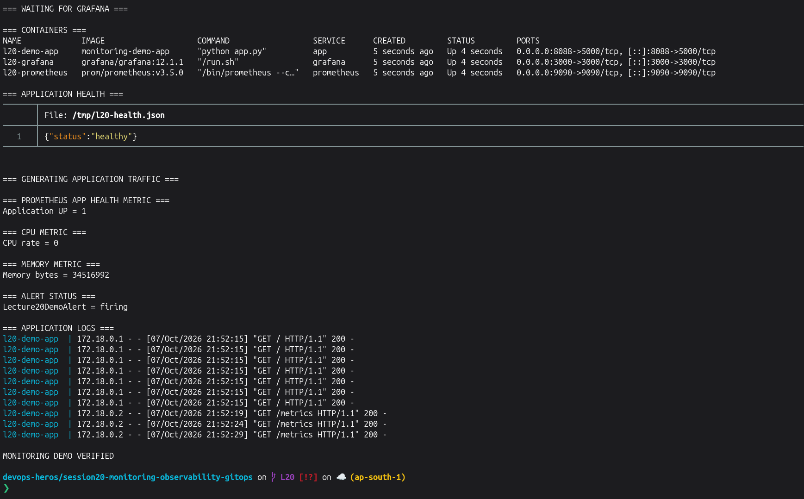
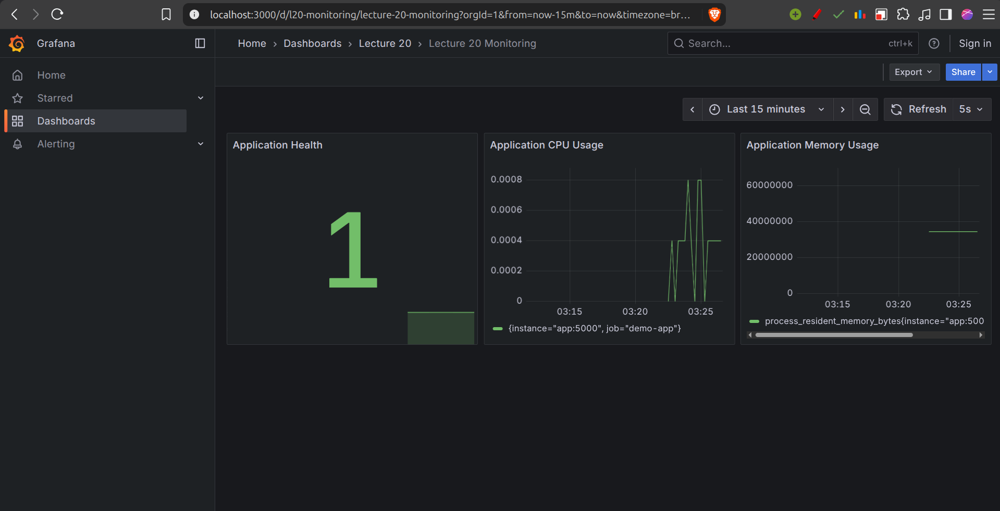
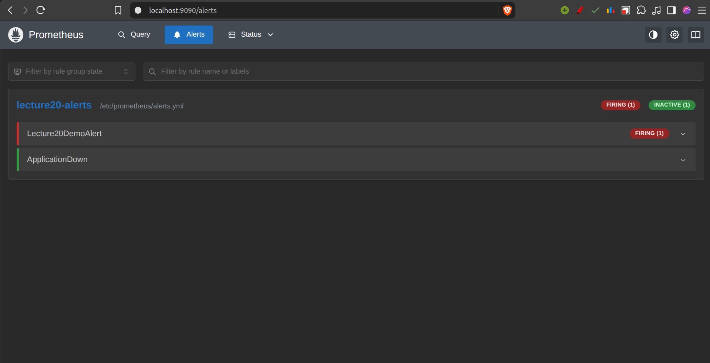
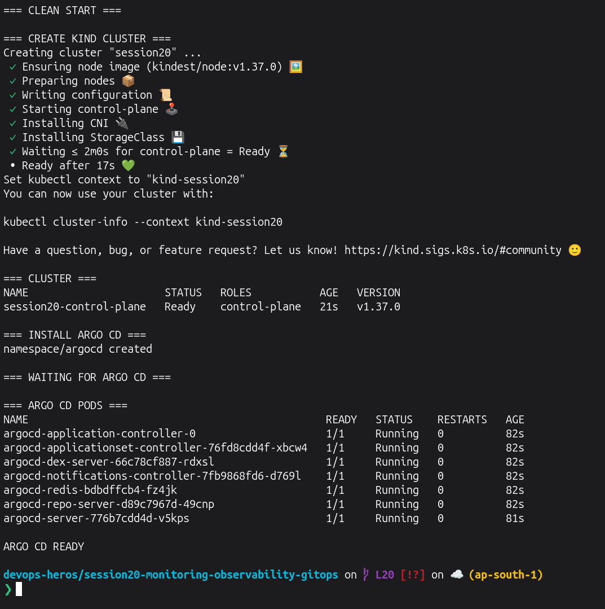
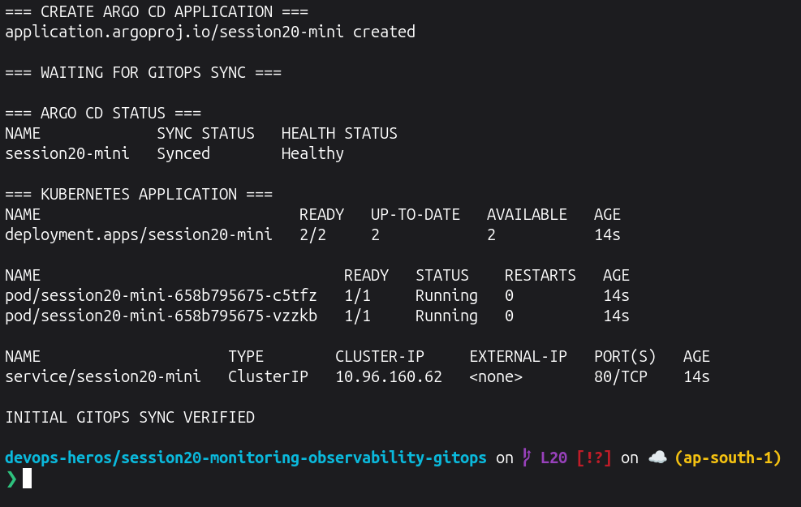
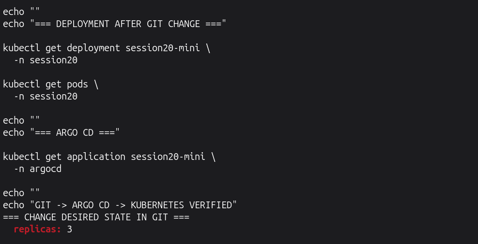
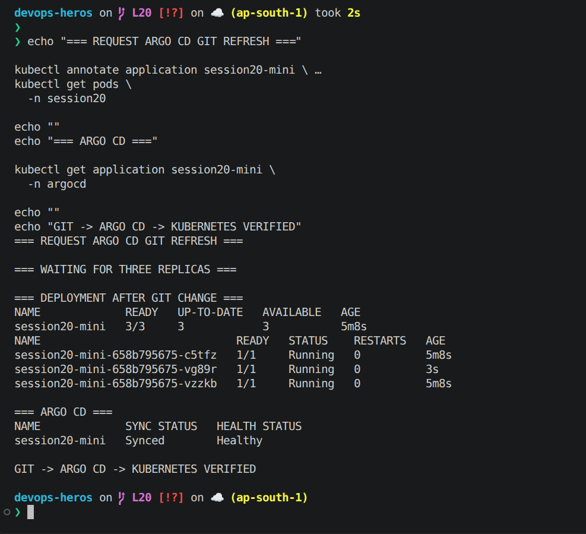
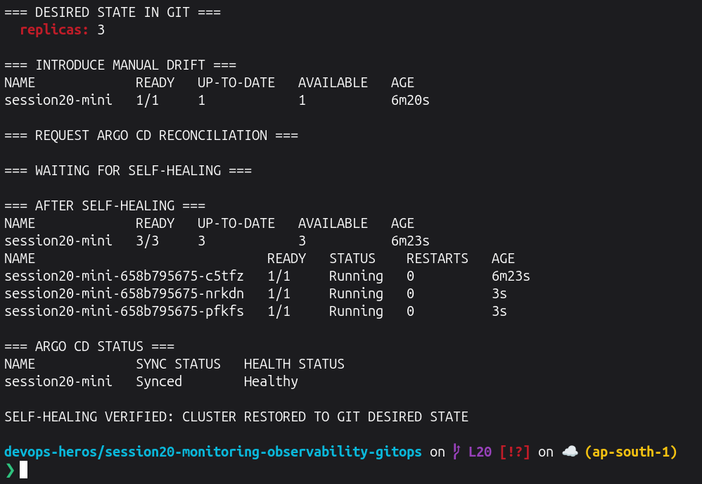
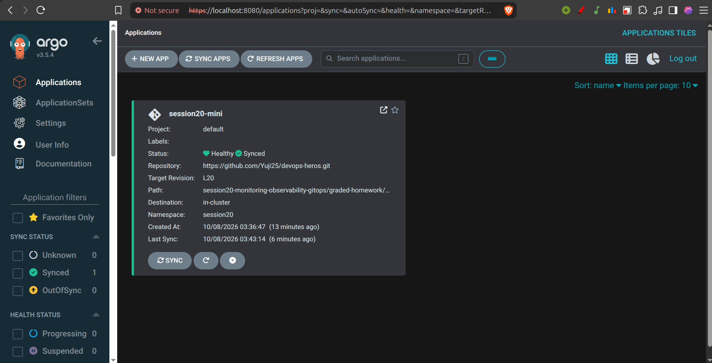
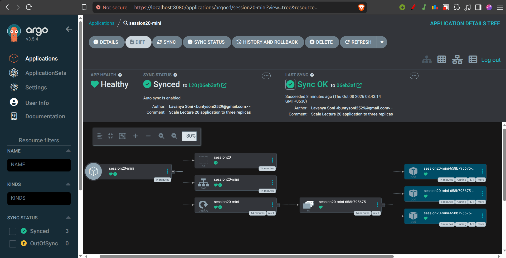

# Lecture 20 Graded Homework

## Overview

This lecture demonstrates three important DevOps areas:

```text
Monitoring
    ↓
Metrics + Logs + Alerts + Health

Observability
    ↓
Metrics + Logs + Traces

GitOps
    ↓
Git → Argo CD → Kubernetes
```

---

# Preflight

Run from:

```text
devops-heros/session20-monitoring-observability-gitops
```

```bash
set -e

echo "=== DOCKER ==="
docker info >/dev/null
docker --version
docker compose version

echo ""
echo "=== KUBECTL ==="
kubectl version --client

echo ""
echo "=== KIND ==="

if ! command -v kind >/dev/null 2>&1; then
  ARCH=$(uname -m)

  case "$ARCH" in
    x86_64) KIND_ARCH="amd64" ;;
    aarch64|arm64) KIND_ARCH="arm64" ;;
    *)
      echo "Unsupported architecture: $ARCH"
      exit 1
      ;;
  esac

  KIND_VERSION=$(
    curl -fsSL https://api.github.com/repos/kubernetes-sigs/kind/releases/latest |
    sed -n 's/.*"tag_name": "\(v[^"]*\)".*/\1/p' |
    head -n 1
  )

  curl -fsSL \
    "https://kind.sigs.k8s.io/dl/${KIND_VERSION}/kind-linux-${KIND_ARCH}" \
    -o /tmp/kind

  chmod +x /tmp/kind
  sudo mv /tmp/kind /usr/local/bin/kind
fi

kind version

echo ""
echo "=== GIT BRANCH ==="
git branch --show-current

echo ""
echo "PREFLIGHT PASSED"
```

---

# Task 1 — Monitoring Demo

Monitoring answers questions such as:

```text
Is the application running?
How much CPU is it using?
How much memory is it using?
Are alerts firing?
What happened in the logs?
```

For this demo I used:

```text
Demo Flask App
      ↓ /metrics
Prometheus
      ↓
Grafana

Prometheus
      ↓
Alert Rules
```

---

## Task 1.1 — Create Monitoring Project

Ran this entire block:

```bash
set -e

rm -rf graded-homework/monitoring-demo

mkdir -p \
  graded-homework/monitoring-demo/app \
  graded-homework/monitoring-demo/prometheus \
  graded-homework/monitoring-demo/grafana/provisioning/datasources \
  graded-homework/monitoring-demo/grafana/provisioning/dashboards \
  graded-homework/monitoring-demo/grafana/dashboards \
  graded-homework/screenshots

cat > graded-homework/monitoring-demo/app/app.py <<'EOF'
from flask import Flask, jsonify, Response
from prometheus_client import Counter, generate_latest, CONTENT_TYPE_LATEST

app = Flask(__name__)

REQUESTS = Counter(
    "lecture20_http_requests_total",
    "Total HTTP requests received by the Lecture 20 application",
    ["endpoint"]
)

@app.route("/")
def home():
    REQUESTS.labels(endpoint="/").inc()
    return "Lecture 20 Monitoring Demo\n"

@app.route("/health")
def health():
    REQUESTS.labels(endpoint="/health").inc()
    return jsonify(status="healthy")

@app.route("/metrics")
def metrics():
    return Response(generate_latest(), mimetype=CONTENT_TYPE_LATEST)

if __name__ == "__main__":
    app.run(host="0.0.0.0", port=5000)
EOF

cat > graded-homework/monitoring-demo/app/requirements.txt <<'EOF'
Flask==3.1.2
prometheus-client==0.23.1
EOF

cat > graded-homework/monitoring-demo/app/Dockerfile <<'EOF'
FROM python:3.12-slim

WORKDIR /app

COPY requirements.txt .
RUN pip install --no-cache-dir -r requirements.txt

COPY app.py .

EXPOSE 5000

CMD ["python", "app.py"]
EOF

cat > graded-homework/monitoring-demo/prometheus/prometheus.yml <<'EOF'
global:
  scrape_interval: 5s
  evaluation_interval: 5s

rule_files:
  - /etc/prometheus/alerts.yml

scrape_configs:
  - job_name: prometheus
    static_configs:
      - targets:
          - prometheus:9090

  - job_name: demo-app
    metrics_path: /metrics
    static_configs:
      - targets:
          - app:5000
EOF

cat > graded-homework/monitoring-demo/prometheus/alerts.yml <<'EOF'
groups:
  - name: lecture20-alerts
    rules:
      - alert: Lecture20DemoAlert
        expr: vector(1)
        labels:
          severity: demo
        annotations:
          summary: Lecture 20 alert demonstration

      - alert: ApplicationDown
        expr: up{job="demo-app"} == 0
        labels:
          severity: critical
        annotations:
          summary: Lecture 20 demo application is down
EOF

cat > graded-homework/monitoring-demo/grafana/provisioning/datasources/prometheus.yml <<'EOF'
apiVersion: 1

datasources:
  - name: Prometheus
    uid: prometheus
    type: prometheus
    access: proxy
    url: http://prometheus:9090
    isDefault: true
EOF

cat > graded-homework/monitoring-demo/grafana/provisioning/dashboards/dashboard.yml <<'EOF'
apiVersion: 1

providers:
  - name: Lecture20
    folder: Lecture 20
    type: file
    options:
      path: /var/lib/grafana/dashboards
EOF

cat > graded-homework/monitoring-demo/grafana/dashboards/lecture20.json <<'EOF'
{
  "annotations": {
    "list": []
  },
  "editable": true,
  "panels": [
    {
      "datasource": {
        "type": "prometheus",
        "uid": "prometheus"
      },
      "fieldConfig": {
        "defaults": {}
      },
      "gridPos": {
        "h": 8,
        "w": 8,
        "x": 0,
        "y": 0
      },
      "id": 1,
      "targets": [
        {
          "expr": "up{job=\"demo-app\"}",
          "refId": "A"
        }
      ],
      "title": "Application Health",
      "type": "stat"
    },
    {
      "datasource": {
        "type": "prometheus",
        "uid": "prometheus"
      },
      "fieldConfig": {
        "defaults": {}
      },
      "gridPos": {
        "h": 8,
        "w": 8,
        "x": 8,
        "y": 0
      },
      "id": 2,
      "targets": [
        {
          "expr": "rate(process_cpu_seconds_total{job=\"demo-app\"}[30s])",
          "refId": "A"
        }
      ],
      "title": "Application CPU Usage",
      "type": "timeseries"
    },
    {
      "datasource": {
        "type": "prometheus",
        "uid": "prometheus"
      },
      "fieldConfig": {
        "defaults": {}
      },
      "gridPos": {
        "h": 8,
        "w": 8,
        "x": 16,
        "y": 0
      },
      "id": 3,
      "targets": [
        {
          "expr": "process_resident_memory_bytes{job=\"demo-app\"}",
          "refId": "A"
        }
      ],
      "title": "Application Memory Usage",
      "type": "timeseries"
    }
  ],
  "refresh": "5s",
  "schemaVersion": 39,
  "tags": [
    "lecture20"
  ],
  "time": {
    "from": "now-15m",
    "to": "now"
  },
  "title": "Lecture 20 Monitoring",
  "uid": "l20-monitoring",
  "version": 1
}
EOF

cat > graded-homework/monitoring-demo/docker-compose.yml <<'EOF'
services:
  app:
    build:
      context: ./app
    container_name: l20-demo-app
    ports:
      - "8088:5000"

  prometheus:
    image: prom/prometheus:v3.5.0
    container_name: l20-prometheus
    ports:
      - "9090:9090"
    volumes:
      - ./prometheus/prometheus.yml:/etc/prometheus/prometheus.yml:ro
      - ./prometheus/alerts.yml:/etc/prometheus/alerts.yml:ro

  grafana:
    image: grafana/grafana:12.1.1
    container_name: l20-grafana
    ports:
      - "3000:3000"
    environment:
      GF_AUTH_ANONYMOUS_ENABLED: "true"
      GF_AUTH_ANONYMOUS_ORG_ROLE: Viewer
      GF_USERS_ALLOW_SIGN_UP: "false"
    volumes:
      - ./grafana/provisioning:/etc/grafana/provisioning:ro
      - ./grafana/dashboards:/var/lib/grafana/dashboards:ro
    depends_on:
      - prometheus
EOF

echo "=== MONITORING PROJECT CREATED ==="

find graded-homework/monitoring-demo \
  -maxdepth 4 \
  -type f \
  | sort
```

---

## Task 1.2 — Start and Verify Monitoring

```bash
set -e

cd graded-homework/monitoring-demo

echo "=== START MONITORING STACK ==="

docker compose up -d --build

echo ""
echo "=== WAITING FOR APPLICATION ==="

for i in {1..30}; do
  if curl -fsS http://127.0.0.1:8088/health >/tmp/l20-health.json 2>/dev/null; then
    break
  fi
  sleep 2
done

curl -fsS http://127.0.0.1:8088/health >/tmp/l20-health.json

echo ""
echo "=== WAITING FOR PROMETHEUS ==="

for i in {1..30}; do
  if curl -fsS http://127.0.0.1:9090/-/ready >/dev/null 2>&1; then
    break
  fi
  sleep 2
done

curl -fsS http://127.0.0.1:9090/-/ready >/dev/null

echo ""
echo "=== WAITING FOR GRAFANA ==="

for i in {1..30}; do
  if curl -fsS http://127.0.0.1:3000/api/health >/dev/null 2>&1; then
    break
  fi
  sleep 2
done

curl -fsS http://127.0.0.1:3000/api/health >/dev/null

echo ""
echo "=== CONTAINERS ==="
docker compose ps

echo ""
echo "=== APPLICATION HEALTH ==="
cat /tmp/l20-health.json
echo

echo ""
echo "=== GENERATING APPLICATION TRAFFIC ==="

for i in {1..100}; do
  curl -fsS http://127.0.0.1:8088/ >/dev/null
done

sleep 15

echo ""
echo "=== PROMETHEUS APP HEALTH METRIC ==="

curl -fsSG \
  --data-urlencode 'query=up{job="demo-app"}' \
  http://127.0.0.1:9090/api/v1/query |
python3 -c '
import json,sys
r=json.load(sys.stdin)["data"]["result"]
print("Application UP =", r[0]["value"][1] if r else "NO DATA")
'

echo ""
echo "=== CPU METRIC ==="

curl -fsSG \
  --data-urlencode 'query=rate(process_cpu_seconds_total{job="demo-app"}[30s])' \
  http://127.0.0.1:9090/api/v1/query |
python3 -c '
import json,sys
r=json.load(sys.stdin)["data"]["result"]
print("CPU rate =", r[0]["value"][1] if r else "NO DATA")
'

echo ""
echo "=== MEMORY METRIC ==="

curl -fsSG \
  --data-urlencode 'query=process_resident_memory_bytes{job="demo-app"}' \
  http://127.0.0.1:9090/api/v1/query |
python3 -c '
import json,sys
r=json.load(sys.stdin)["data"]["result"]
print("Memory bytes =", r[0]["value"][1] if r else "NO DATA")
'

echo ""
echo "=== ALERT STATUS ==="

for i in {1..15}; do
  ALERTS=$(curl -fsS http://127.0.0.1:9090/api/v1/alerts)

  if echo "$ALERTS" | grep -q '"state":"firing"'; then
    break
  fi

  sleep 2
done

echo "$ALERTS" |
python3 -c '
import json,sys
d=json.load(sys.stdin)
for a in d["data"]["alerts"]:
    print(a["labels"]["alertname"], "=", a["state"])
'

echo ""
echo "=== APPLICATION LOGS ==="

docker compose logs --tail=10 app

echo ""
echo "MONITORING DEMO VERIFIED"

cd ../..
```

**Screenshot:**
> 

---

# Metrics

Metrics are numerical measurements collected over time.

Examples from this demo include:

```text
Application health
CPU usage
Memory usage
HTTP requests
```

Prometheus collects these values by scraping the application's `/metrics` endpoint.

---

# Logs

Logs record events produced by an application.

For example:

```text
HTTP request received
Application started
Error occurred
Container restarted
```

Logs are useful when investigating what happened at a particular time.

---

# Alerts

Alerts automatically notify or flag situations that match a condition.

This demo contains:

```text
Lecture20DemoAlert
ApplicationDown
```

`ApplicationDown` would fire when:

```text
up{job="demo-app"} == 0
```

---

# CPU and Memory Utilization

The Python Prometheus client exposes process metrics such as:

```text
process_cpu_seconds_total
process_resident_memory_bytes
```

Prometheus can query these values and Grafana can visualize them.

---

# Application Health

The application provides:

```text
GET /health
```

and returns:

```json
{
  "status": "healthy"
}
```

Prometheus also reports:

```text
up{job="demo-app"} = 1
```

when the target is healthy.

---

# Grafana Dashboard

## Browser Screenshot 1 — Grafana



---

# Prometheus Alerts

## Browser Screenshot 2 — Prometheus



---

# Task 2 — Observability

Monitoring and observability are related but are not exactly the same.

```text
Monitoring:
"Is something wrong?"

Observability:
"Why is it behaving this way?"
```

---

## Metrics

Metrics are numeric values measured over time.

Examples:

```text
CPU usage
Memory usage
Request count
Error rate
Latency
```

Common tools:

```text
Prometheus
Grafana
Kubernetes Metrics Server
```

---

## Logs

Logs are records of events produced by applications and infrastructure.

Example:

```text
10:20:01 Application started
10:20:04 GET /health 200
10:20:10 Database connection failed
```

Common tools include:

```text
Loki
Elasticsearch
Fluent Bit
Grafana
```

---

## Traces

A trace follows a request as it travels through several services.

Example:

```text
User Request
    ↓
API
    ↓
Order Service
    ↓
Payment Service
    ↓
Database
```

If the complete request takes two seconds, tracing can help identify which service caused most of the delay.

Common tools include:

```text
OpenTelemetry
Jaeger
Grafana Tempo
```

---

# Why Observability Is Required

Monitoring can tell us:

```text
Latency is high
```

Observability provides enough data to investigate:

```text
Which service is slow?
Which request failed?
What happened before the failure?
Where is the bottleneck?
```

This becomes especially important in distributed systems and microservices.

---

# Kubernetes Observability

A Kubernetes environment contains many moving parts:

```text
Cluster
├── Nodes
├── Pods
├── Deployments
├── Services
└── Applications
```

Useful observability information includes:

```text
Node CPU and memory
Pod CPU and memory
Container logs
Application metrics
Pod restarts
Deployment health
Request traces
```

Typical tools are:

```text
Prometheus    → metrics
Grafana       → dashboards
kubectl logs  → logs
OpenTelemetry → telemetry collection
Jaeger/Tempo  → traces
```

---

# Task 3 — GitOps

GitOps uses Git as the source of truth for application and infrastructure configuration. The course material describes the flow as Developer → Git → Argo CD → Kubernetes. 

```text
Developer
    ↓
Git
    ↓
Argo CD
    ↓
Kubernetes
```

---

# Git as the Source of Truth

The desired state is stored in Git.

Example:

```yaml
replicas: 3
```

means:

```text
Desired State = 3 replicas
```

If Kubernetes has another value, Argo CD compares the actual state with Git and reconciles the difference.

---

# Declarative Configuration

GitOps stores the desired result rather than a series of manual commands.

For example:

```text
Deployment should have 3 replicas.
```

instead of repeatedly running:

```text
kubectl scale ...
```

---

# Continuous Reconciliation

Argo CD continuously compares:

```text
Git Desired State
       ↕
Kubernetes Actual State
```

When they differ, Argo CD works to restore the desired configuration.

---

# GitOps Architecture

```text
             GitHub
        Desired State
              |
              v
           Argo CD
              |
        Reconciliation
              |
              v
         Kubernetes
              |
       +------+------+
       |             |
  Deployment       Service
       |
      Pods
```

---

# Before GitOps Demo — Stop Monitoring Stack

This reduces Docker memory usage before starting Argo CD.

Make sure the **Grafana and Prometheus screenshots are already taken**.

```bash
cd graded-homework/monitoring-demo

docker compose down

cd ../..

echo "Monitoring stack stopped"
```

---

# Task 3.1 — Prepare GitOps Repository Files

This used my **current fork and current `L20` branch**, so there was no second GitHub repository to create.

```bash
set -e

BRANCH=$(git branch --show-current)

if [ "$BRANCH" != "L20" ]; then
  echo "Expected branch L20 but current branch is: $BRANCH"
  exit 1
fi

REMOTE=$(git remote get-url origin)

case "$REMOTE" in
  git@github.com:*)
    REPO_URL="https://github.com/${REMOTE#git@github.com:}"
    ;;
  https://github.com/*)
    REPO_URL="$REMOTE"
    ;;
  *)
    echo "Unsupported GitHub remote: $REMOTE"
    exit 1
    ;;
esac

REPO_URL="${REPO_URL%.git}.git"

REPO_SLUG="${REPO_URL#https://github.com/}"
REPO_SLUG="${REPO_SLUG%.git}"

echo "=== GITOPS SOURCE ==="
echo "Repository: $REPO_URL"
echo "Branch:     $BRANCH"

echo ""
echo "=== VERIFY PUBLIC GITHUB REPOSITORY ==="

curl -fsS \
  "https://api.github.com/repos/${REPO_SLUG}" \
  >/dev/null

echo "Public GitHub repository verified"

rm -rf graded-homework/gitops-app
mkdir -p graded-homework/gitops-app

cat > graded-homework/gitops-app/namespace.yaml <<'EOF'
apiVersion: v1
kind: Namespace
metadata:
  name: session20
EOF

cat > graded-homework/gitops-app/deployment.yaml <<'EOF'
apiVersion: apps/v1
kind: Deployment
metadata:
  name: session20-mini
  namespace: session20
spec:
  replicas: 2
  selector:
    matchLabels:
      app: session20-mini
  template:
    metadata:
      labels:
        app: session20-mini
    spec:
      containers:
        - name: nginx
          image: nginx:1.27-alpine
          ports:
            - containerPort: 80
EOF

cat > graded-homework/gitops-app/service.yaml <<'EOF'
apiVersion: v1
kind: Service
metadata:
  name: session20-mini
  namespace: session20
spec:
  selector:
    app: session20-mini
  ports:
    - port: 80
      targetPort: 80
EOF

cat > graded-homework/argocd-application.yaml <<EOF
apiVersion: argoproj.io/v1alpha1
kind: Application
metadata:
  name: session20-mini
  namespace: argocd
spec:
  project: default

  source:
    repoURL: ${REPO_URL}
    targetRevision: ${BRANCH}
    path: session20-monitoring-observability-gitops/graded-homework/gitops-app

  destination:
    server: https://kubernetes.default.svc
    namespace: session20

  syncPolicy:
    automated:
      prune: true
      selfHeal: true
    syncOptions:
      - CreateNamespace=true
EOF

echo ""
echo "=== FILES ==="
find graded-homework/gitops-app -type f | sort

echo ""
echo "=== COMMIT GITOPS MANIFESTS ==="

git add \
  graded-homework/gitops-app \
  graded-homework/argocd-application.yaml

if ! git diff --cached --quiet; then
  git commit -m "Add Lecture 20 GitOps application"
else
  echo "GitOps files already committed"
fi

git push origin "$BRANCH"

echo ""
echo "GITOPS MANIFESTS PUSHED"
```

---

# Task 3.2 — Create kind Cluster and Install Argo CD

```bash
set -e

echo "=== CLEAN START ==="

if kind get clusters 2>/dev/null | grep -qx session20; then
  kind delete cluster --name session20
fi

echo ""
echo "=== CREATE KIND CLUSTER ==="

kind create cluster \
  --name session20 \
  --wait 120s

echo ""
echo "=== CLUSTER ==="

kubectl get nodes

echo ""
echo "=== INSTALL ARGO CD ==="

kubectl create namespace argocd

kubectl apply \
  -n argocd \
  --server-side \
  --force-conflicts \
  -f https://raw.githubusercontent.com/argoproj/argo-cd/stable/manifests/install.yaml \
  >/dev/null

echo ""
echo "=== WAITING FOR ARGO CD ==="

for i in {1..60}; do
  TOTAL=$(
    kubectl get pods -n argocd --no-headers 2>/dev/null |
    wc -l
  )

  NOT_READY=$(
    kubectl get pods -n argocd --no-headers 2>/dev/null |
    awk '{
      split($2,a,"/");
      if (a[1] != a[2] || $3 != "Running") n++
    }
    END {print n+0}'
  )

  if [ "$TOTAL" -ge 5 ] && [ "$NOT_READY" -eq 0 ]; then
    break
  fi

  sleep 5
done

NOT_READY=$(
  kubectl get pods -n argocd --no-headers |
  awk '{
    split($2,a,"/");
    if (a[1] != a[2] || $3 != "Running") n++
  }
  END {print n+0}'
)

if [ "$NOT_READY" -ne 0 ]; then
  kubectl get pods -n argocd
  echo "Argo CD did not become ready"
  exit 1
fi

echo ""
echo "=== ARGO CD PODS ==="

kubectl get pods -n argocd

echo ""
echo "ARGO CD READY"
```

**Screenshot:**
> 

---

# Task 3.3 — Create Argo CD Application

```bash
set -e

echo "=== CREATE ARGO CD APPLICATION ==="

kubectl apply \
  -f graded-homework/argocd-application.yaml

echo ""
echo "=== WAITING FOR GITOPS SYNC ==="

SUCCESS=0

for i in {1..60}; do
  SYNC=$(
    kubectl get application session20-mini \
      -n argocd \
      -o jsonpath='{.status.sync.status}' \
      2>/dev/null || true
  )

  HEALTH=$(
    kubectl get application session20-mini \
      -n argocd \
      -o jsonpath='{.status.health.status}' \
      2>/dev/null || true
  )

  READY=$(
    kubectl get deployment session20-mini \
      -n session20 \
      -o jsonpath='{.status.readyReplicas}' \
      2>/dev/null || true
  )

  if [ "$SYNC" = "Synced" ] &&
     [ "$HEALTH" = "Healthy" ] &&
     [ "$READY" = "2" ]; then

    SUCCESS=1
    break
  fi

  sleep 5
done

if [ "$SUCCESS" -ne 1 ]; then
  kubectl get applications -n argocd
  kubectl get all -n session20 2>/dev/null || true
  exit 1
fi

echo ""
echo "=== ARGO CD STATUS ==="

kubectl get applications -n argocd

echo ""
echo "=== KUBERNETES APPLICATION ==="

kubectl get deployment,pods,service \
  -n session20

echo ""
echo "INITIAL GITOPS SYNC VERIFIED"
```

**Screenshot:**

> 

---

# Task 3.4 — Git Change: Scale 2 → 3

This is the main GitOps demonstration.

The Kubernetes Deployment is **not manually scaled**. Instead, the desired state is changed in Git and pushed.

```bash
set -e

BRANCH=$(git branch --show-current)

echo "=== CHANGE DESIRED STATE IN GIT ==="

sed -i \
  's/replicas: 2/replicas: 3/' \
  graded-homework/gitops-app/deployment.yaml

grep 'replicas:' \
  graded-homework/gitops-app/deployment.yaml

echo ""
echo "=== COMMIT AND PUSH ==="

git add graded-homework/gitops-app/deployment.yaml

if ! git diff --cached --quiet; then
  git commit -m "Scale Lecture 20 application to three replicas"
else
  echo "Replica count is already committed as 3"
fi

git push origin "$BRANCH"

echo ""
echo "=== REQUEST ARGO CD GIT REFRESH ==="

kubectl annotate application session20-mini \
  -n argocd \
  argocd.argoproj.io/refresh=hard \
  --overwrite \
  >/dev/null

echo ""
echo "=== WAITING FOR THREE REPLICAS ==="

SUCCESS=0

for i in {1..60}; do
  SPEC=$(
    kubectl get deployment session20-mini \
      -n session20 \
      -o jsonpath='{.spec.replicas}' \
      2>/dev/null || true
  )

  READY=$(
    kubectl get deployment session20-mini \
      -n session20 \
      -o jsonpath='{.status.readyReplicas}' \
      2>/dev/null || true
  )

  SYNC=$(
    kubectl get application session20-mini \
      -n argocd \
      -o jsonpath='{.status.sync.status}' \
      2>/dev/null || true
  )

  if [ "$SPEC" = "3" ] &&
     [ "$READY" = "3" ] &&
     [ "$SYNC" = "Synced" ]; then

    SUCCESS=1
    break
  fi

  sleep 5
done

if [ "$SUCCESS" -ne 1 ]; then
  echo "GitOps scale did not finish in time"
  exit 1
fi

echo ""
echo "=== DEPLOYMENT AFTER GIT CHANGE ==="

kubectl get deployment session20-mini \
  -n session20

kubectl get pods \
  -n session20

echo ""
echo "=== ARGO CD ==="

kubectl get application session20-mini \
  -n argocd

echo ""
echo "GIT -> ARGO CD -> KUBERNETES VERIFIED"
```

**Screenshot:** 

> 
> 

---

# Task 3.5 — Self-Healing Demo

Git currently says:

```text
replicas = 3
```

Now I manually introduce drift by changing the cluster to one replica.

Argo CD should detect the difference and restore the deployment to three replicas.

```bash
set -e

echo "=== DESIRED STATE IN GIT ==="

grep 'replicas:' \
  graded-homework/gitops-app/deployment.yaml

echo ""
echo "=== INTRODUCE MANUAL DRIFT ==="

kubectl scale deployment session20-mini \
  -n session20 \
  --replicas=1 \
  >/dev/null

kubectl get deployment session20-mini \
  -n session20

echo ""
echo "=== REQUEST ARGO CD RECONCILIATION ==="

kubectl annotate application session20-mini \
  -n argocd \
  argocd.argoproj.io/refresh=hard \
  --overwrite \
  >/dev/null

echo ""
echo "=== WAITING FOR SELF-HEALING ==="

SUCCESS=0

for i in {1..40}; do
  SPEC=$(
    kubectl get deployment session20-mini \
      -n session20 \
      -o jsonpath='{.spec.replicas}'
  )

  READY=$(
    kubectl get deployment session20-mini \
      -n session20 \
      -o jsonpath='{.status.readyReplicas}' \
      2>/dev/null || true
  )

  if [ "$SPEC" = "3" ] &&
     [ "$READY" = "3" ]; then

    SUCCESS=1
    break
  fi

  sleep 3
done

if [ "$SUCCESS" -ne 1 ]; then
  echo "Self-healing did not complete"
  exit 1
fi

echo ""
echo "=== AFTER SELF-HEALING ==="

kubectl get deployment session20-mini \
  -n session20

kubectl get pods \
  -n session20

echo ""
echo "=== ARGO CD STATUS ==="

kubectl get application session20-mini \
  -n argocd

echo ""
echo "SELF-HEALING VERIFIED: CLUSTER RESTORED TO GIT DESIRED STATE"
```

**Screenshot:**
> 

---

# Desired State vs Actual State

```text
Git
Desired = 3 replicas
        |
        v
     Argo CD
   Compare State
        |
        v
Kubernetes
Actual = 1 replica
        |
        v
   Reconciliation
        |
        v
Actual = 3 replicas
```

This is self-healing.

---

# Argo CD UI

## Browser Screenshot 3 — Argo CD

Ran:

```bash
set -e

pkill -f \
  '[k]ubectl port-forward svc/argocd-server -n argocd 8080:443' \
  2>/dev/null || true

nohup kubectl port-forward \
  svc/argocd-server \
  -n argocd \
  8080:443 \
  >/tmp/l20-argocd-portforward.log \
  2>&1 &

for i in {1..20}; do
  if curl -kfsS https://127.0.0.1:8080 >/dev/null 2>&1; then
    break
  fi
  sleep 1
done

PASSWORD=$(
  kubectl -n argocd \
    get secret argocd-initial-admin-secret \
    -o jsonpath='{.data.password}' |
  base64 -d
)

echo "=== ARGO CD UI ==="
echo "URL:      https://localhost:8080"
echo "Username: admin"
echo "Password: $PASSWORD"
```

Opened:

```text
https://localhost:8080
```


**Screenshot:**
> 
> 

---

# GitOps Workflow

```text
Developer changes YAML
        ↓
git commit
        ↓
git push
        ↓
GitHub becomes desired state
        ↓
Argo CD detects change
        ↓
Argo CD reconciles
        ↓
Kubernetes changes
```

---

# Monitoring vs Observability vs GitOps

| Area | Main Purpose |
|---|---|
| Monitoring | Detect system health and known problems |
| Observability | Understand why the system behaves a certain way |
| GitOps | Keep deployed state synchronized with Git |

---

# What I Practiced

```text
Metrics
Logs
Alerts
CPU monitoring
Memory monitoring
Application health
Prometheus
Grafana
Observability
Metrics / Logs / Traces
GitOps
Git as source of truth
Declarative configuration
Argo CD
Continuous reconciliation
Automatic synchronization
Self-healing
Kubernetes
kind
```

---

# Result

The monitoring demo successfully collected application health, CPU and memory metrics using Prometheus and displayed them through Grafana.

The observability section documented the three main pillars:

```text
Metrics
Logs
Traces
```

The GitOps demo successfully demonstrated:

```text
Git change
    ↓
Argo CD synchronization
    ↓
Kubernetes update
```

The application scaled from two to three replicas by changing Git rather than manually changing Kubernetes.

Argo CD self-healing was also verified by manually changing the Deployment to one replica and observing it return to the three replicas defined in Git.

---

# Final Cleanup

```bash
echo "=== STOP MONITORING STACK ==="

if [ -d graded-homework/monitoring-demo ]; then
  docker compose \
    -f graded-homework/monitoring-demo/docker-compose.yml \
    down \
    -v \
    --remove-orphans \
    2>/dev/null || true
fi

echo ""
echo "=== STOP ARGO CD PORT FORWARD ==="

pkill -f \
  '[k]ubectl port-forward svc/argocd-server -n argocd 8080:443' \
  2>/dev/null || true

echo ""
echo "=== DELETE LECTURE 20 KIND CLUSTER ==="

if kind get clusters 2>/dev/null | grep -qx session20; then
  kind delete cluster --name session20
fi

echo ""
echo "=== RESTORE MINIKUBE CONTEXT ==="

if kubectl config get-contexts -o name 2>/dev/null |
   grep -qx minikube; then

  kubectl config use-context minikube >/dev/null
fi

echo ""
echo "=== VERIFY CLEANUP ==="

if kind get clusters 2>/dev/null | grep -qx session20; then
  echo "session20 cluster still exists"
  exit 1
else
  echo "session20 kind cluster removed"
fi

if docker ps -a \
  --format '{{.Names}}' |
  grep -Eq '^l20-(demo-app|prometheus|grafana)$'; then

  echo "Lecture 20 monitoring containers still exist"
  exit 1
else
  echo "Lecture 20 monitoring containers removed"
fi

echo ""
echo "LECTURE 20 CLEANUP COMPLETE"
```