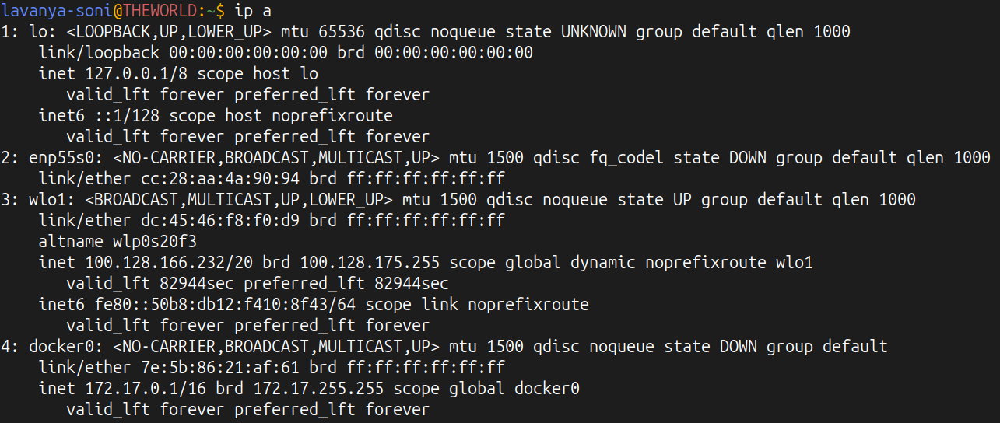
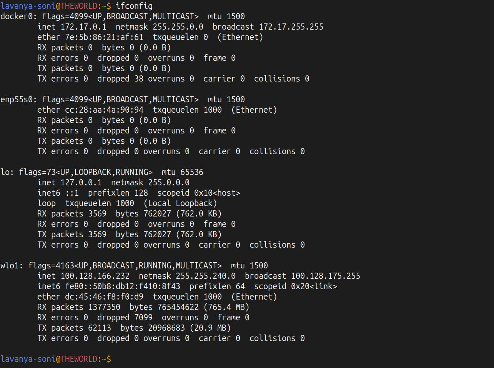
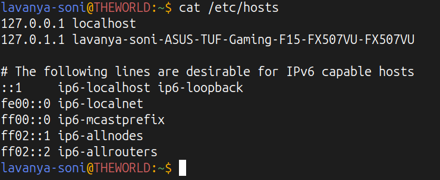
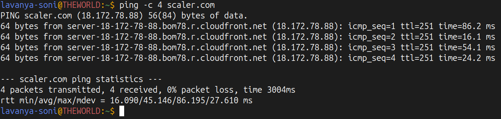
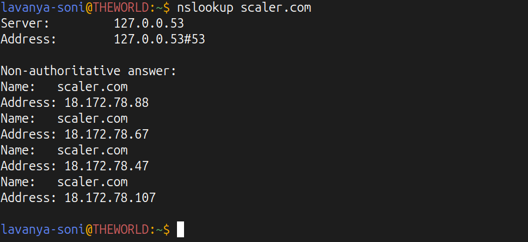
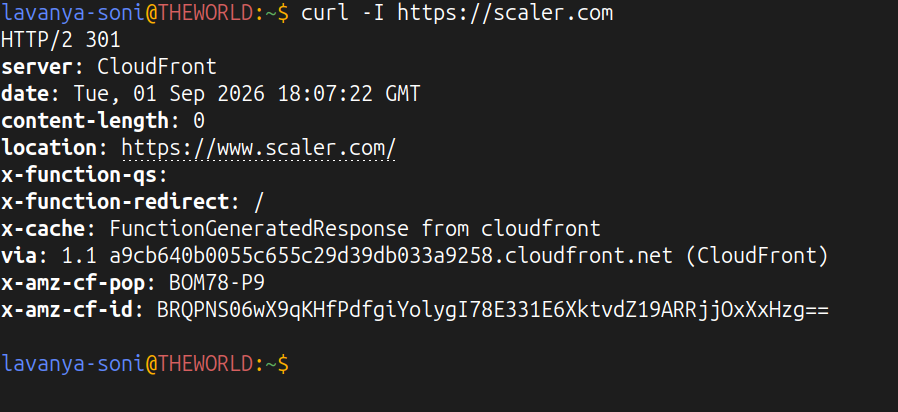
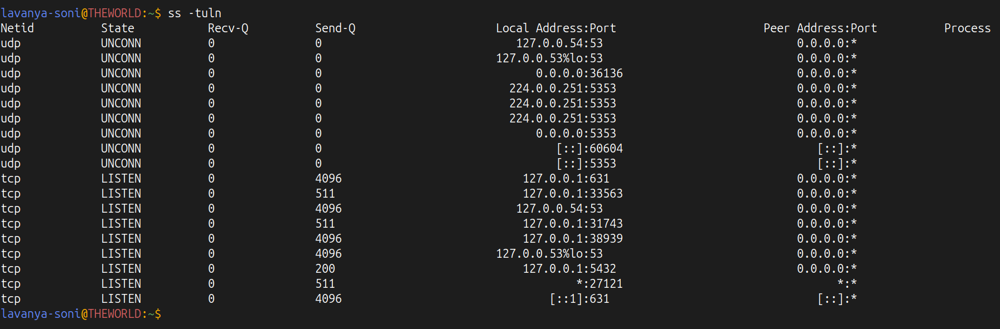
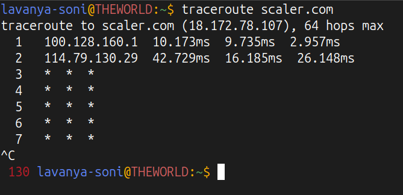
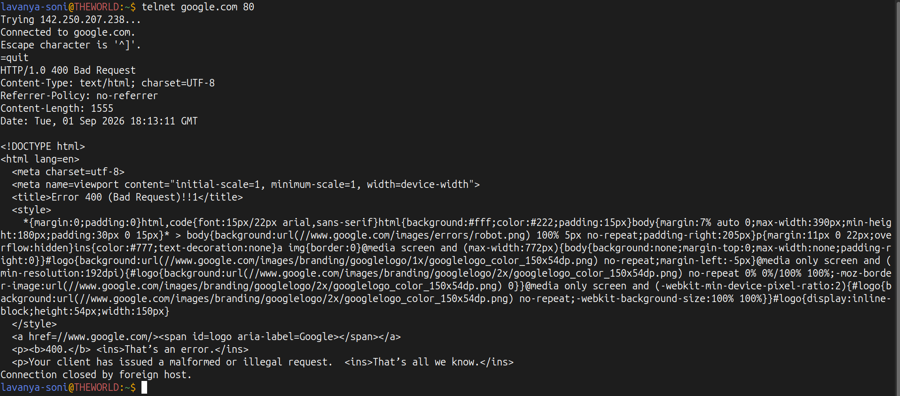

# Lecture 4 Graded Homework

## 1. IP address check

Command:
```bash
ip a

# or 

ifconfig
```

Output: 



> Shows the private IP address of my machine and lists all active network cards.

## 2. View local host mappings

Command: 
```bash
cat /etc/hosts
```

Output: 


> This is a local address book on my computer that links names (like localhost) to IP addresses (like 127.0.0.1) before asking the internet.

## 3. Testing website reachable 

Command: 
```bash
ping -c 4 scaler.com
```

Output: 


> Sends 4 small test packets(ICMP) to scaler.com to check if the connection works, measures how fast it responds (latency), and checks if any data was lost.

## 4. IP address of a site

Command: 
```bash
nslookup scaler.com
```

Output: 


> Acts like an internet phonebook. It translates the readable name scaler.com into the actual numerical IP addresses where the servers live.

## 5. Chk website headers and response

Command: 
```bash
curl -I https://scaler.com
```

Output: 


> Asks the website server for its basic info card (headers) instead of downloading the whole page. It shows things like HTTP status (e.g., 200 OK or 301 Redirect), server type, and content size.

## 6. Seeing which ports are open/listening

Command: 
```bash
ss -tuln
```

Output: 


> Lists all the open "doors" (ports) on my computer where background apps (like SSH on port 22 or web servers on port 80) are waiting for connections. 

## 7. Tracing the internet path (hops)

Command: 
```bash
traceroute scaler.com
```

Output: 


> Shows every single router (hop) my data packet travels through to get from my laptop to Scaler's server.

## 8. Test if a specific port is open on a server

Command: 
```bash
telnet google.com 80
```

Output: 


> Knocks directly on port 80 of Google's server to check if it's open and ready to accept web traffic.

