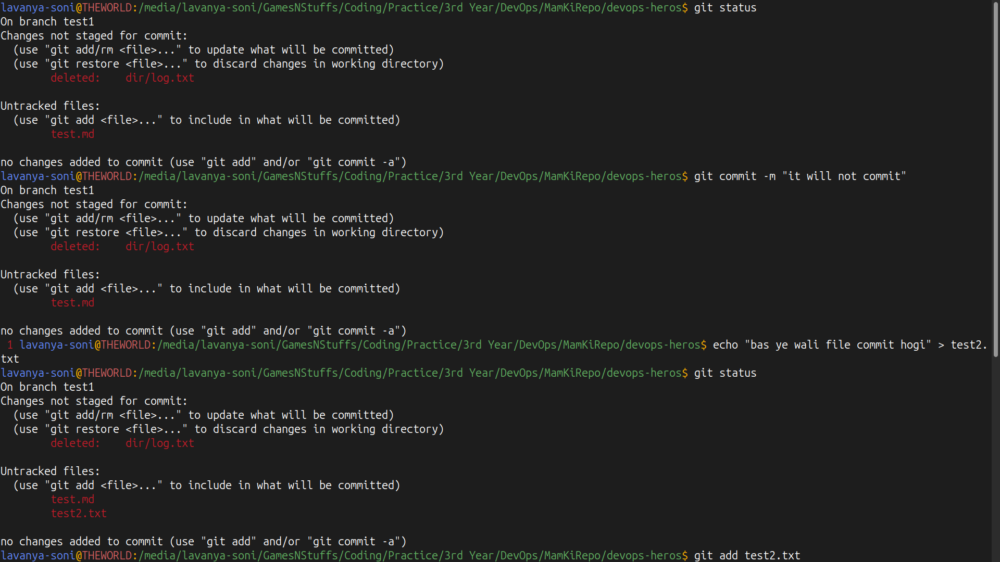
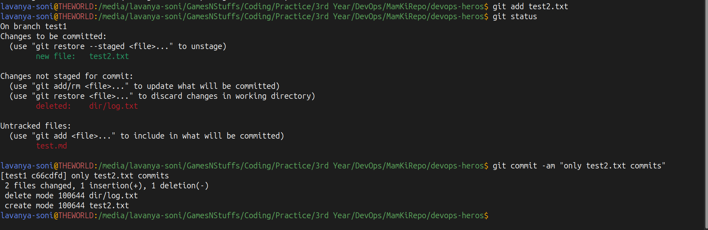
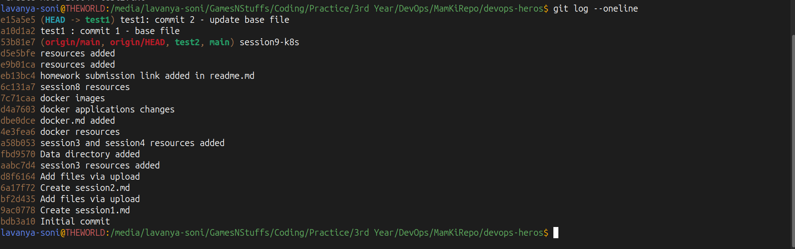
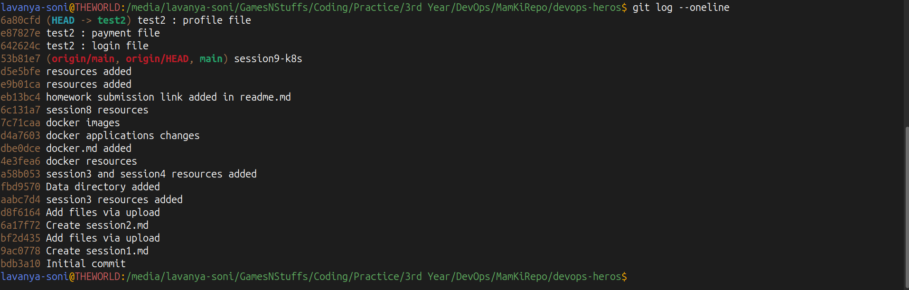
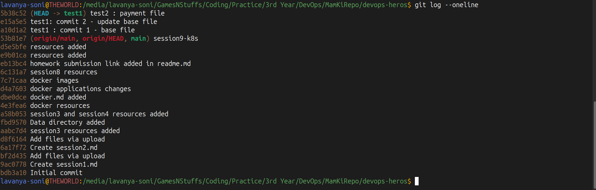

# Lecture 5 Graded Homework

## Task 1: `git commit -a -m` vs `git commit -m`
* `git commit -m`: Commits only files that are explicitly staged using `git add`.
* `git commit -a -m`: Automatically stages and commits all modified tracked files in one command. It ignores untracked (brand new) files.

### Commands Tested:
1. `git commit -m "Initial commit"` -> Requires manual `git add`.
2. `git commit -a -m "Updated tracked file"` -> Skips `git add` for existing files.

### Terminal Outputs:

---

## Task 2: Git Cherry-Pick
Cherry-picked a single commit from `test2` branch into `test1` branch.

### History Log on `test1` before cherry-pick:

### History Log on `test2` before cherry-pick:

### History Log on `test1` after cherry-pick:

### Files in `test1` after cherry-pick:
