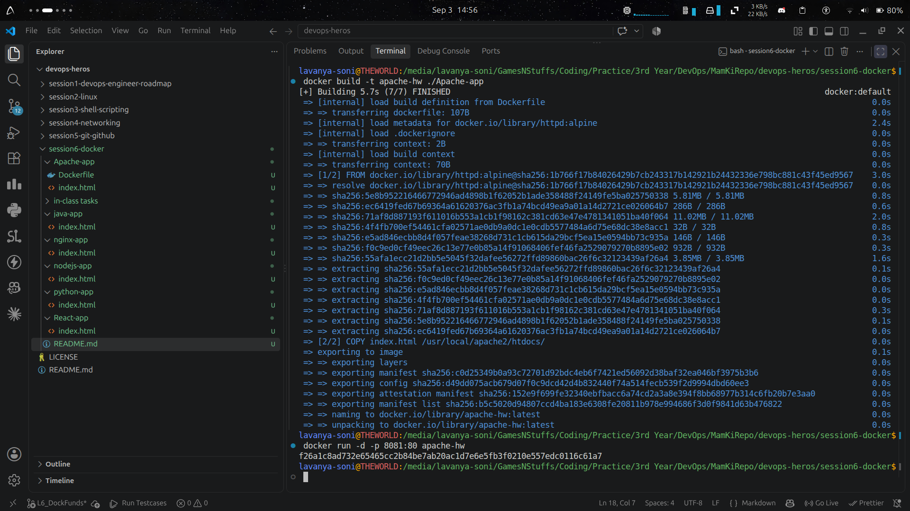
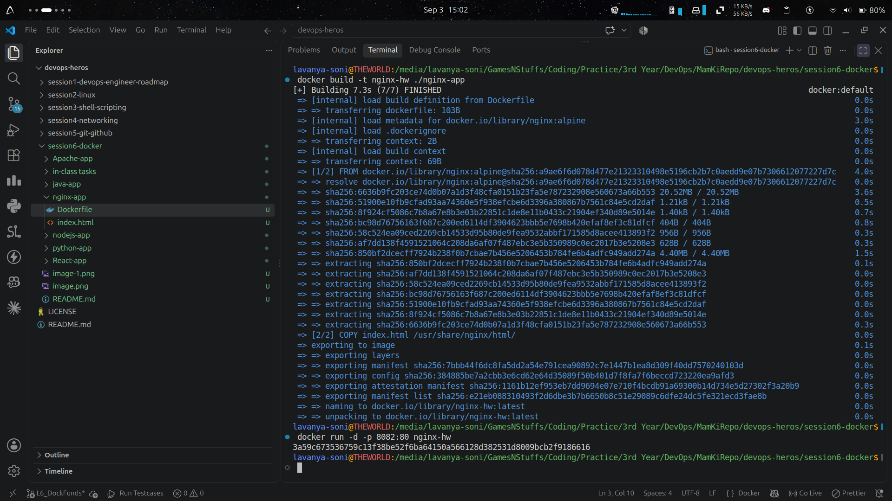
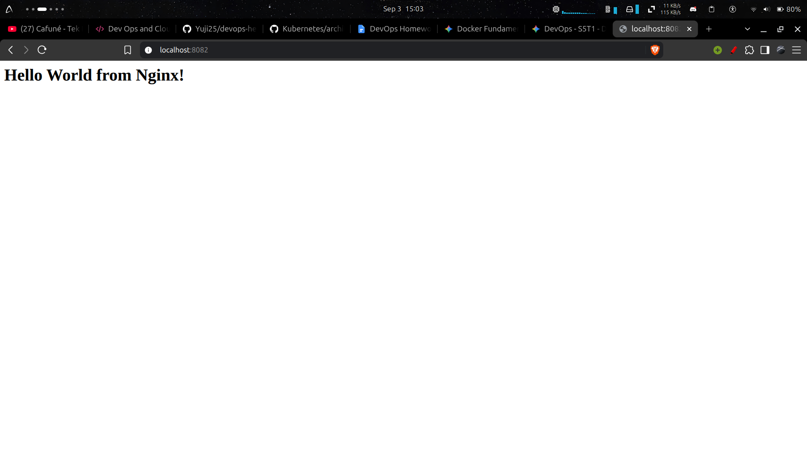
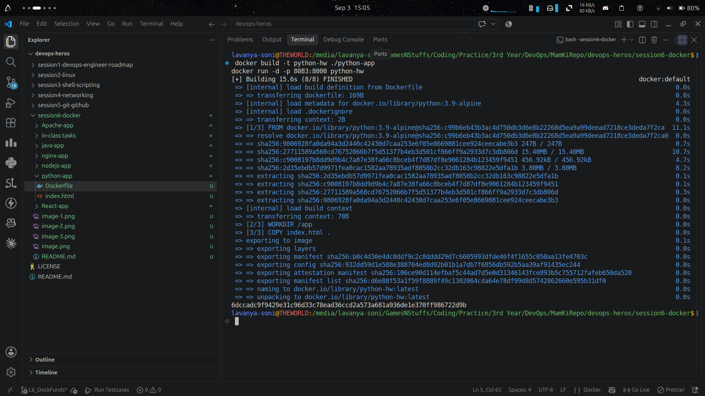
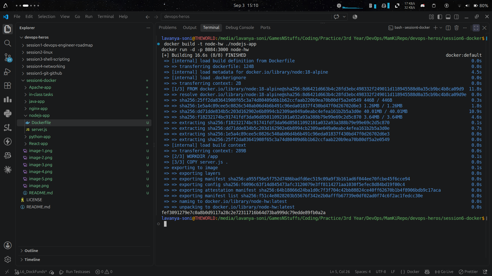
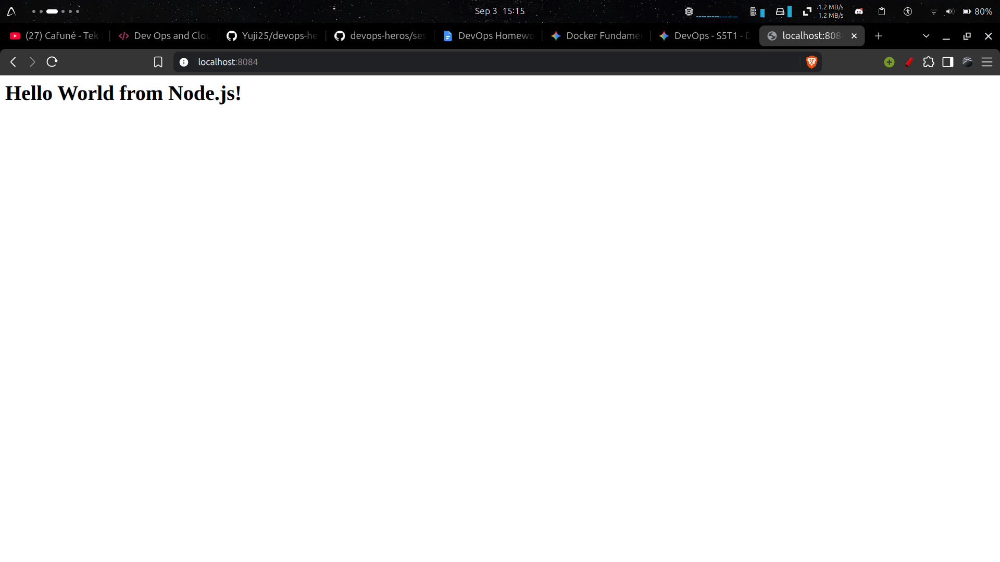
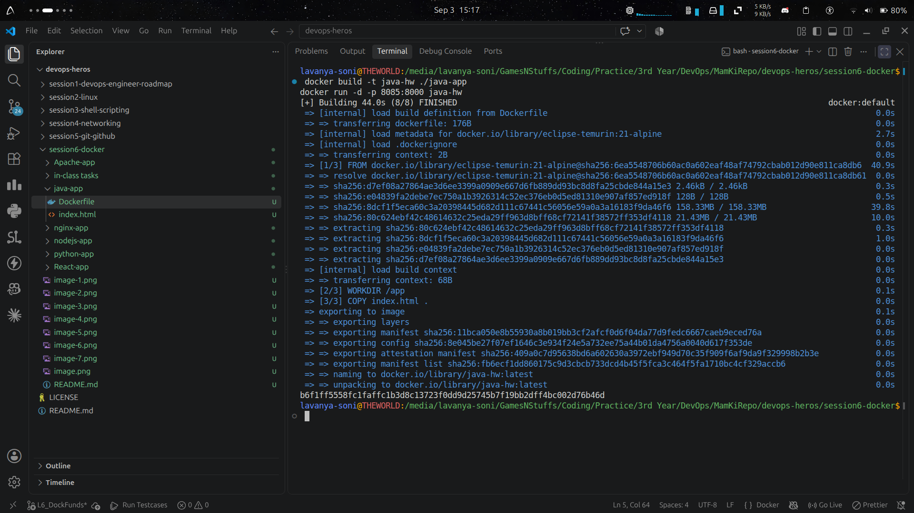
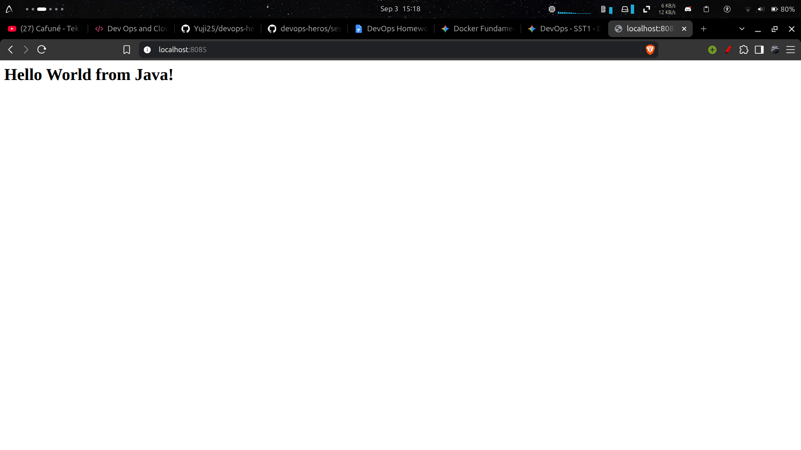
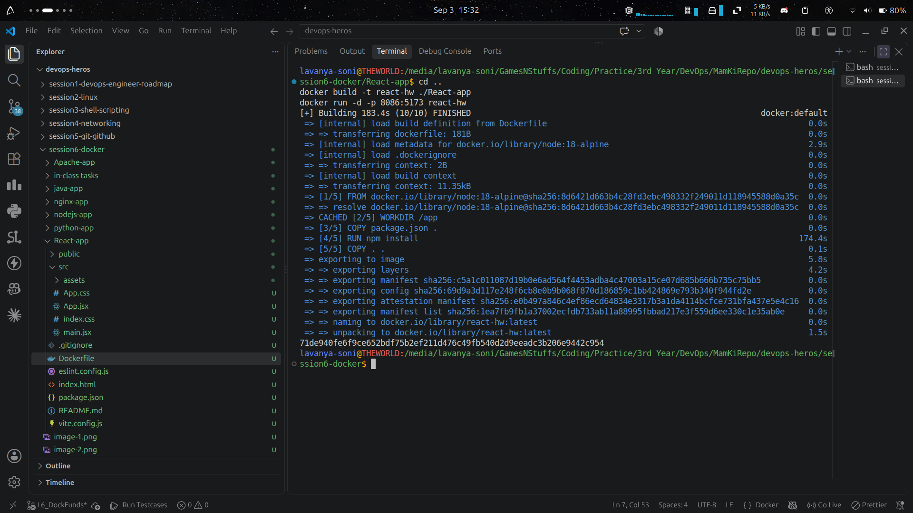
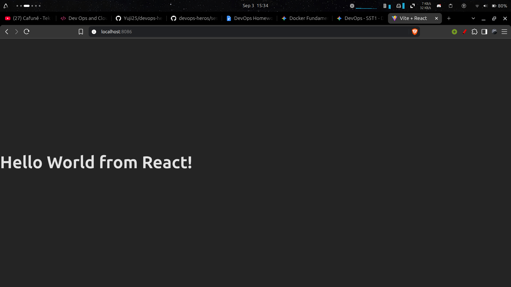

# Lecture 6 Graded Homework

## 1. Apache App
### - Terminal : 

### - Browser : 

## 2. Nginx App
### - Terminal : 

### - Browser : 

## 3. Python App
### - Terminal : 

### - Browser : 

## 4. Node App
### - Terminal : 

### - Browser : 

## 5. Java App
### - Terminal : 

### - Browser : 

## 6. React App
### - Terminal : 

### - Browser : 
