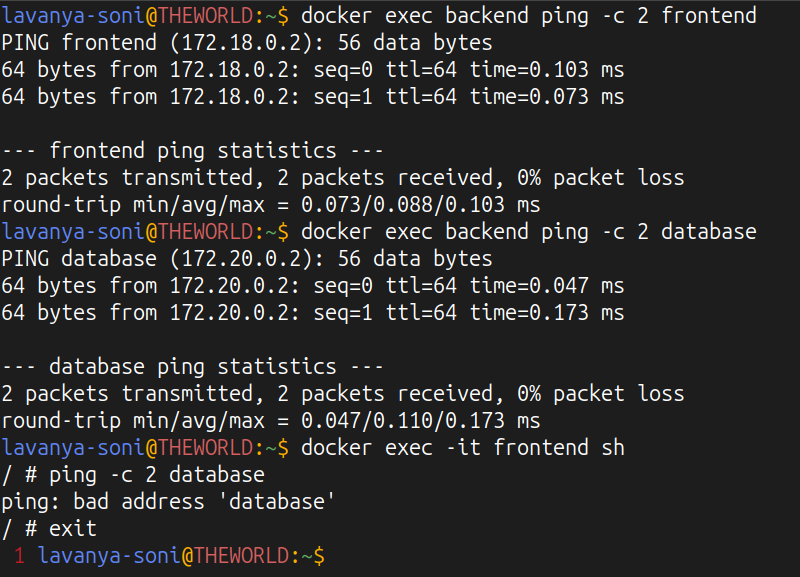
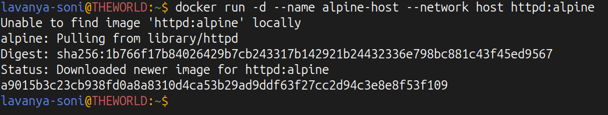
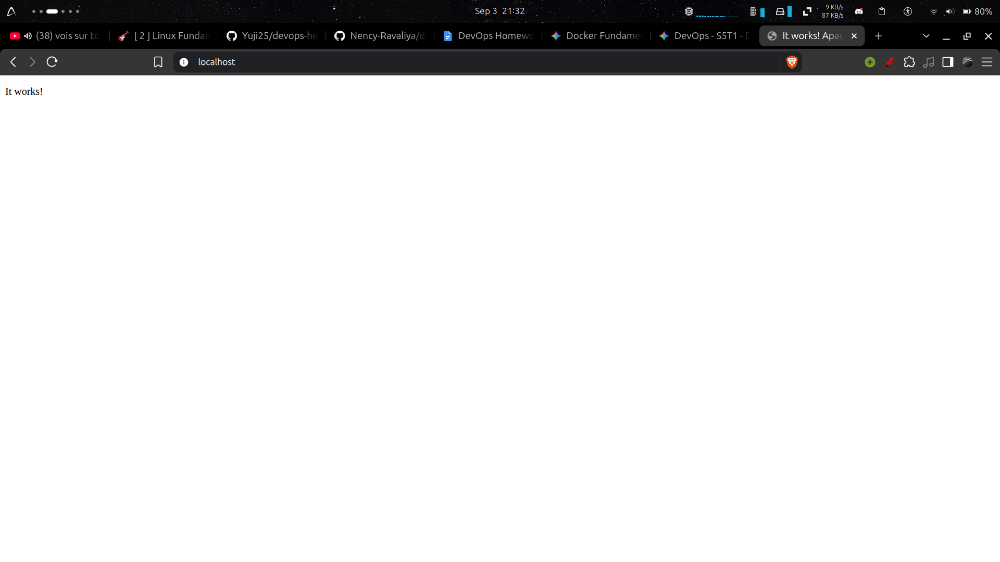
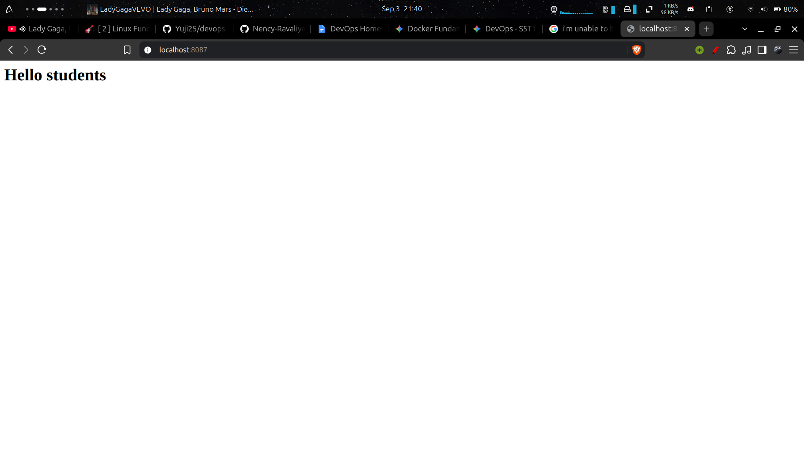
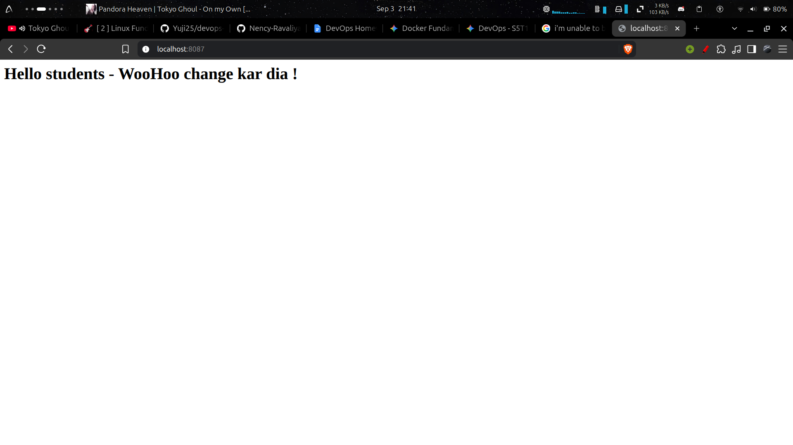

# Lecture 8 Graded Homework

## Task 1: Docker Container Networking
- Create 3 containers:
    - Frontend
    - Backend
    - Database
- Use Nginx or Alpine images for the frontend and backend.
- Use the MySQL image for the database.
- Create 3 different Docker networks.
- Add the backend container to 2 networks.
- Check connectivity between the containers.

### Conectivity Check:

> Containers on the same network can communicate with each other, while containers on different networks cannot communicate unless they are connected to both networks.

## Task 2: Host Network
- Pull the Apache2 image from Docker Hub.
- Create an Apache2 container using the host network.
- Access the Apache website directly on port 80.

### Terminal Output:

### Browser Output:

## Task 3: Bind Mount
- Create a folder on your local machine.
- Create an index.html file with Hello students as the content.
- Bind mount the folder to an Nginx container.
- Access the Nginx website and verify the content.
- Modify the index.html file.
- Verify that the changes are reflected without restarting the container.

### Browser Output 1:

### Browser Output 2:

## Task 4: Overlay Network
- Research Docker overlay networks.
- Understand their use cases.
- Understand how overlay networks work across multiple Docker hosts.

### My Understanding of Overlay Networks:
Docker Overlay networks are used to connect multiple Docker daemons together, allowing swarm services to communicate with each other. While bridge networks isolate containers on a single host machine, overlay networks create a distributed network among multiple Docker hosts. This is essential for scaling applications across a cluster of servers, providing seamless container-to-container communication across different physical machines with built-in encryption and DNS resolution.
