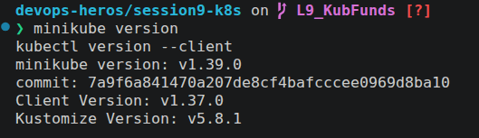
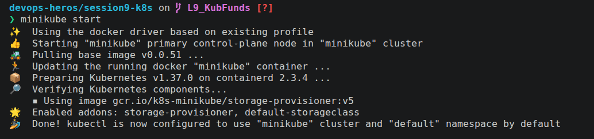
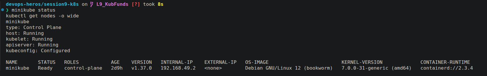
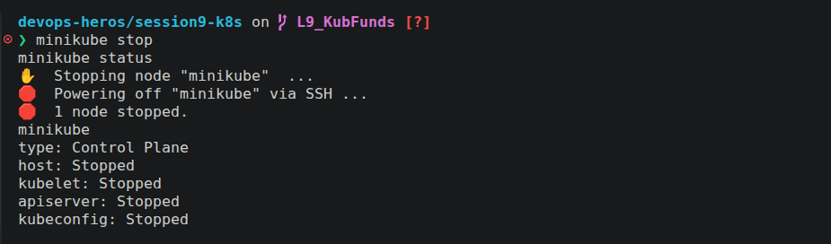

# Lecture 9 Graded Assignment

**Author:** Lavanya Soni
**Roll:** 24BCS10028
**Course:** SST DevOps & Cloud [SWE]
**Session:** 09 - Kubernetes Fundamentals
**Repository:** devops-heros / session9-k8s

---

## Task 1: Minikube & CLI Installation Verification

Verify that Minikube and the Kubernetes CLI (`kubectl`) are successfully installed on the local system.

**Commands:**
```bash
minikube version
kubectl version --client
```
**Output:**
> 

## Task 2: Starting the Minikube Kubernetes Cluster

Initialize the local single-node Kubernetes cluster using the containerized runtime environment.

**Command:**

```bash
minikube start
```

**Output:**
> 

## Task 3: Verifying Cluster Status & Node Health

Inspect the status of the local cluster control plane, kubelet, API server, and verify the node is in `Ready` state.

**Commands:**

```bash
minikube status
kubectl get nodes -o wide
```

**Output:**
> 

## Task 4: Stopping the Minikube Cluster

Gracefully power down the Minikube cluster VM/container to release system resources.

**Command:**

```bash
minikube stop
minikube status
```

**Output:**
> 

## Task 5: Kubernetes Cluster Architecture & Component Analysis

Comprehensive breakdown of the core components powering a Kubernetes cluster based on jo mam ne padhaya and documentations.


### 1. Control Plane (Master Node)
* **`kube-apiserver`**: The front-door REST API of the cluster; every command (`kubectl`, UI, internal controllers) communicates through it.
* **`etcd`**: Distributed key-value database that stores the entire cluster state, object metadata, and desired configurations.
* **`kube-scheduler`**: Assigns unscheduled pods to the best-suited worker node based on resource availability and constraints.
* **`kube-controller-manager`**: Continuous control loop that ensures the actual cluster state matches the desired state (e.g., ReplicaSet, Node controller).

### 2. Worker Node (Data Plane)
* **`kubelet`**: The node agent that receives PodSpecs from the API server, starts containers, and reports node/pod health back.
* **`kube-proxy`**: Manages network routing and `iptables`/`IPVS` rules to enable service-level networking across pods.
* **`CRI (Container Runtime Interface)`**: The underlying container runtime (e.g., `containerd`) that pulls images and runs container processes.
* **`Pod`**: The smallest deployable unit in Kubernetes, wrapping one or more containers that share the same IP and storage.

### 3. Key Takeaway
* **Why K8s over Docker Swarm?** Docker Swarm struggled with complex rollouts, large-scale multi-node scaling, and enterprise cloud integrations. Kubernetes provides self-healing, rolling updates, and declarative automation supported natively across all major cloud providers (EKS, AKS, GKE).